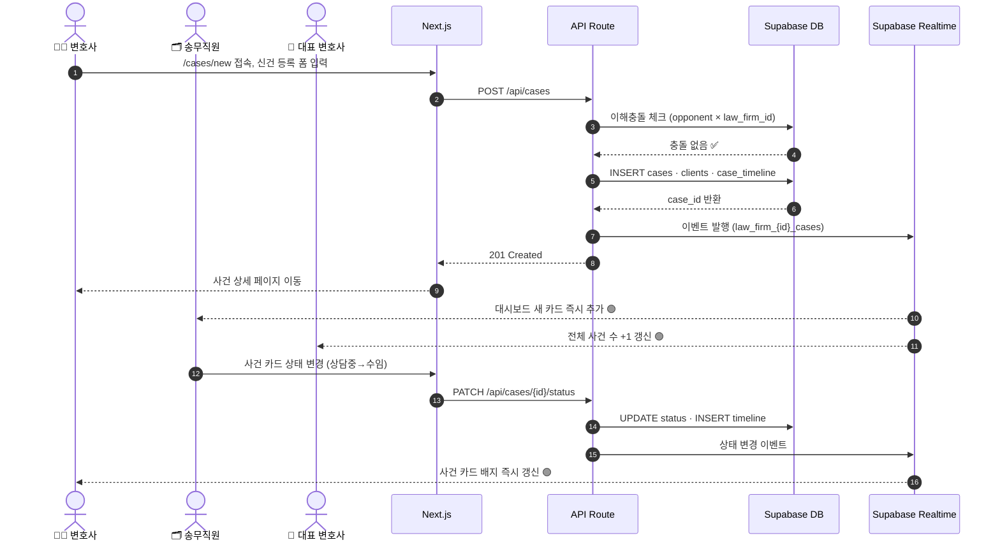
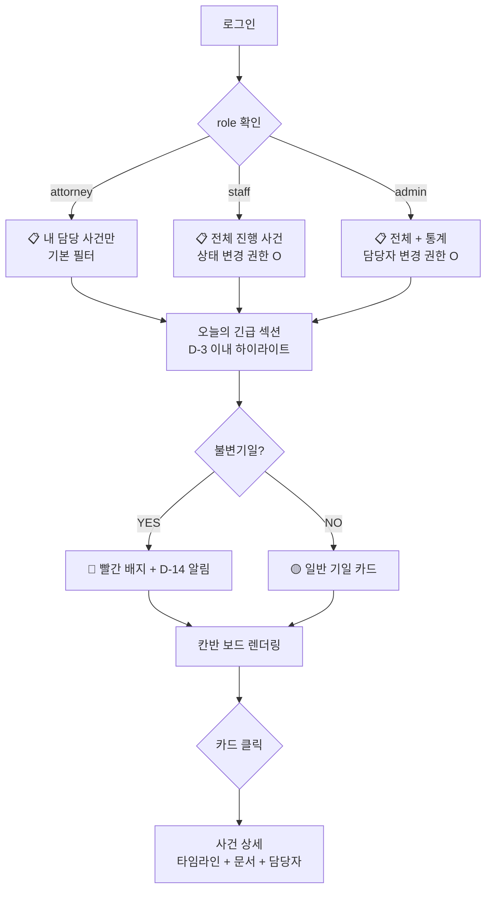
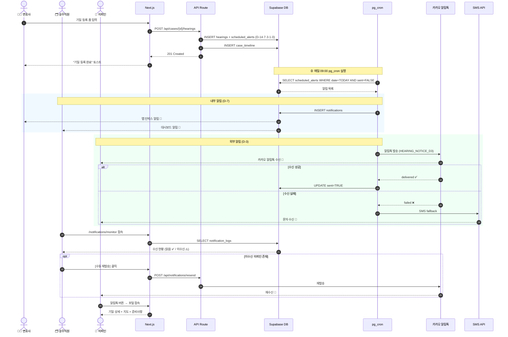
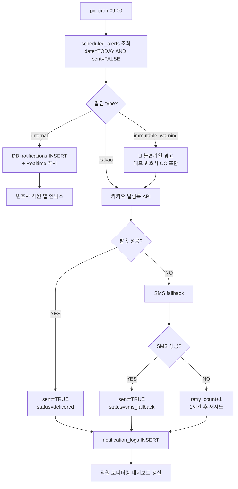
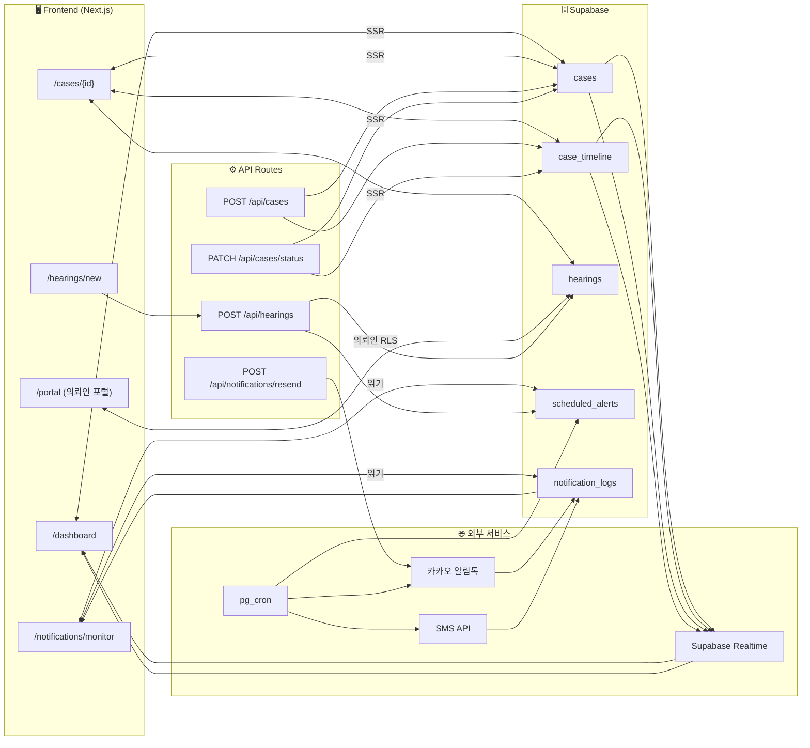

# 🔍 로탑(LawTop) IA — 벤치마크 통합 마스터 문서
**경쟁사 심층 분석 · MVP 우선순위 · 시스템 구현 플로우 완전 통합**

> 리서치 기준일: 2026-03-10 | 최종 통합: 2026-03-11  
> 출처: lawtop.co.kr 직접 크롤링 + 사용자 리뷰 + PM Agent 분석 + 시스템 설계  
> 연계 문서: `pm.md` · `_strategy/DOCUMENT_COMMENT_SYSTEM.md` · `_strategy/00_REVENUE_ROADMAP.md` · `_strategy/13_PAYMENT_CONTRACT_FLOW.md`  
> 구현 스프린트: **Sprint B** = `DocComment Vibe Prompt` (문서허브/코멘트) | **Sprint B-2** = 문서 의뢰 워크플로우 | **Sprint C** = `Esign Vibe Prompt 전자계약` | **C3** = `13_PAYMENT_CONTRACT_FLOW.md` (결제 플로우)
> ⚠️ **필드명 통일**: 본 문서 및 전체 코드에서 `law_firm_id` 대신 **`tenant_id`** 사용. `src/lib/constants/automation.ts` 참고.  
> ⚠️ **트리거 상수 통일**: 모든 `trigger_type` 값은 `src/lib/constants/automation.ts`에서만 관리. Vibe Prompt 개별 수정 금지.

---

## 📌 Executive Summary

| | |
|---|---|
| **목적** | 국내 점유율 1위 법률 ERP 로탑 IA의 전 기능·가격·UX·보안 구조를 완전 분석하여 경쟁사 차별화 전략 및 MVP 기능 도출 |
| **핵심 발견 1** | 로탑은 **C/S(설치형) 아키텍처**로, 웹 SaaS가 아님 → 우리의 **완전 웹·멀티테넌트 SaaS**가 핵심 차별화 |
| **핵심 발견 2** | AI/자동화 기능이 STT 상담록 1가지에 그침 → **AI 버티컬이 공략 공백** |
| **핵심 발견 3** | 사용자 최대 니즈: 기일 누락 방지·수납 관리·정보 통합 → **우리 MVP 방향과 일치** |
| **MVP 선정** | **① 통합 사건 대시보드** (10/10점) + **② 자동 기일 알림 자동화** (9/10점) |
| **즉각 액션** | 로탑의 C/S 한계를 영업 배틀카드로 즉시 활용 + MVP 두 기능 구현 착수 |

---

## PART 1 — 로탑 경쟁사 심층 분석

### 🏢 회사 기본 정보

| 항목 | 내용 |
|---|---|
| **제품명** | 로탑 (LawTop) |
| **운영사** | 로타임비즈텍 (LT-BIZTECH, LTD) |
| **주소** | 서울 서초구 법원로4길 11-6, 3층 로앤컴퍼니빌딩 |
| **연락처** | 02-834-3043 |
| **공식 URL** | [lawtop.co.kr](https://lawtop.co.kr) |
| **규모** | 10년 이상 운영, 10,000명 이상 사용자, 국내 점유율 1위 |
| **특허** | ✅ 특허 등록 완료 |
| **업데이트** | 연평균 12회 × 500여건 무상 업데이트 |

---

### 🏗️ 아키텍처 및 기술 구조

| 항목 | 내용 |
|---|---|
| **구동 방식** | **C/S(Client-Server)형** — 최초 1회 셋업파일 설치 필수 |
| **서버 형태** | ① 자사 구비형 (로펌 자체 서버) ② 로탑 제공형 (IDC/클라우드) |
| **모바일** | Android / iOS 네이티브 앱 (약 30개 메뉴) |
| **암호화** | AES 대칭키 칼럼 암호화 + 매일 백업 |
| **언어 지원** | 한국어·중국어 간체·번체·일본어·영어 (5개국어) |

> ⚠️ **자사 구비형**: 서버 700~1,000만원 + IDC 50만원/월 → 50인 이상 대형 로펌 전용

---

### 🧩 전 기능 완전 분석

#### 1️⃣ 사건 관리 (핵심 모듈)

| 기능 | 상세 |
|---|---|
| **상담 관리** | 상담 파이프라인 + **원클릭으로 진행 사건 전환** |
| **신건 등록** | 대법원 자동 연동 + 엑셀 일괄 등록 + **당사자 → 고객 자동 생성** |
| **진행 관리** | 상담 → 수임 → 진행 → 종결 → 재개 전 사이클 |
| **종결 관리** | 소요일·종결형태·성공여부 자동기록 + 일괄 종결 처리 |
| **이해충돌 체크** | 동일 법인 내 이해충돌 자동 확인 (모바일에서도 즉석 가능) |
| **담당자 일괄 변경** | 입·퇴사 시 사건 담당자 일괄 처리 |

#### 2️⃣ 기일/일정 관리

| 기능 | 상세 |
|---|---|
| **대법원 자동 연동** | 기일·명령·제출서류·송달 자동 수집 |
| **일간 모니터링** | 매일 자동 모니터링 페이지 생성 → 출근 후 10분 |
| **불변기일 관리** | 항소기한 등 별도 화면에서 엄격 알람 관리 |
| **D-Day 소팅** | 기일 임박순 자동 상단 배치 + 색상 구분 (D-3, D-7) |
| **다중 뷰** | 리스트형 / 월력형 / 주단위형 + 원클릭 프린트 |

#### 3️⃣ 문서 관리

| 기능 | 상세 |
|---|---|
| **드래그 앤 드롭** | 약 15개 정보와 자동 결합 (사건·의뢰인·상대방 등) |
| **본문 검색** | 10만 파일·100만 쪽 → **0.8초 이내 검색** (16개 인자) |
| **OCR 자동변환** | 스캔 → 검색 가능한 PDF 변환 |
| **AI STT** | 상담 녹음 → 화자 분리 → 텍스트 자동 생성 |
| **생성주체 분류** | 우리 제출 / 상대 제출 / 법원 문건 자동 분류 |

#### 4️⃣ 고객 관리

| 기능 | 상세 |
|---|---|
| **자동 생성** | 신건 등록 시 → 고객 리스트 자동 생성 |
| **법인 담당자** | 법인 + 실무 담당자 무제한 종속 등록 |
| **퀵 검색** | 실시간 검색 → 원터치 SMS·전화·메일 발송 |

#### 5️⃣ 자문 및 타임시트 (TC/TM)

| 기능 | 상세 |
|---|---|
| **Time Charge(TC)** | 업무시간 입력 → **3분 내 정산 → 청구서 자동 발송** |
| **Time Management(TM)** | 비과금 내부 업무 시간 관리 / TC·TM 이중 입력 방지 |
| **차등 단가** | 자문건별·업무수행자별 시간당 청구액 차등 설정 가능 |

#### 6️⃣ 회계/통계/배당

| 기능 | 상세 |
|---|---|
| **수납 관리** | 로펌 특화 관리회계 (국세청 회계 아님) |
| **미수 관리** | 현행·종결·실비 미수 추적 + 독촉 문자 원클릭 |
| **세금계산서** | 홈택스 접속 없이 로탑 내 발급 |
| **은행 연동** | 국내 20대 은행 / 1시간마다 입출금 자동 수집 |
| **배당 관리** | 개인별·사건별 수임비율 자동 계산, 타임시트 연동 |

#### 7️⃣ 자동 계산/업무 지원

| 기능 | 상세 |
|---|---|
| **손해배상 자동완성** | 자·산·의·기 전 유형 → 소장·청구취지 자동 작성 (시간 1/10 단축) |
| **인지대·송달료 계산** | 보수·가압류·기간·이자 모두 자동 계산 |
| **법률 서식** | **약 3,000종** 제공 + 청구취지 기재례 |

#### 8️⃣ 전자결재·그룹웨어·윈챗

| 기능 | 상세 |
|---|---|
| **전자결재** | 수임·종결·지급품의서·근태 결재 → 수납 자동 전환 |
| **로탑 메신저** | 로펌 업무 특화 + 파일 공유 + 모바일 연동 |
| **윈챗(WinChat)** | 의뢰인↔로펌 채팅 (사건 결합 + 미수현황 노출) |
| **메일/팩스 연동** | Outlook 연계 + 사건 연계 저장 / 전자 팩스 발송 |
| **전화기 연동** | LG U+ 인터넷전화 전용 — 수신 시 사건 자동 팝업 |

---

### 💰 가격 구조 분석

| 버전 | 가격 |
|---|---|
| **Slim** | 1인당 약 30,000원/월 |
| **Medium / Full** | 총 사용자수·운영형태·서버형태·기능범위 협의 |
| **연간 일시불** | 10% 할인 |

> 💡 **가격이 불투명한 협의형 구조** → 우리의 **투명한 퍼블릭 요금제 + 즉시 Free Trial**이 영업 무기

---

### 👥 실제 사용자 리뷰 분석

**✅ 공통 장점 키워드**
```
✅ 법률 업무 로직 완벽 반영
✅ 사건 히스토리 자동 정리
✅ 빠른 업데이트·피드백 반영
✅ 가성비 (합리적 월정액)
✅ 모바일 연동
✅ 낮은 진입 장벽 (1~2일이면 익힘)
```

**⚠️ 공통 단점 (우리의 기회)**
```
⚠️ 디자인이 구식 ("좀 더 산뜻하게" 직접 언급)
⚠️ C/S 설치형 — 웹 즉시 접근 불가
⚠️ AI 기능이 STT 1가지에 그침
⚠️ 가격 투명성 부재
⚠️ 전화 연동이 LG U+ 전용으로 제한
```

---

### 🆚 경쟁사 배틀카드 — 우리 플랫폼 vs 로탑

| 항목 | 로탑 IA | **우리 플랫폼** |
|---|---|---|
| **아키텍처** | C/S 설치형 | ✅ **완전 웹 SaaS** |
| **접근 방법** | 셋업파일 설치 필요 | ✅ **브라우저 즉시 접속** |
| **RLS 멀티테넌트** | ❌ | ✅ **완전 격리 멀티테넌트** |
| **AI 기능** | △ STT 1가지 | ✅ **AI 어시스턴트·판례검색·계약서 리뷰** |
| **카카오 알림톡** | ❌ (SMS만) | ✅ |
| **전자서명** | ❌ | ✅ (이폼싸인 연동) — **Sprint C** `Esign Vibe Prompt 전자계약` 구현 대상 |
| **기업 법인 대시보드** | ❌ | ✅ |
| **요금 투명성** | ❌ 협의 방식 | ✅ **퍼블릭 요금표** |
| **무료 체험** | ❌ PT 요청 필요 | ✅ **즉시 Free Trial** |
| **디자인** | △ 구식 UI | ✅ **모던 프리미엄 UI** |
| **대법원 연동** | ✅ | ✅ |
| **한국 법무법인 특화** | ✅ | ✅ |
| **다국어** | ✅ 5개국어 | 🔄 추가 예정 |
| **손해배상 자동계산** | ✅ | 🔄 추가 예정 |
| **법률 서식 3,000종** | ✅ | 🔄 추가 예정 |

**우리가 반드시 이기는 3가지**
1. **웹 SaaS vs 설치형** — 현대 기업의 기대와 로탑이 불일치
2. **AI 통합** — 로탑 STT 한 가지 vs 우리 全방위 AI
3. **투명한 가격 + 즉시 체험** — 견적 PT 없이 즉시 시작

**로탑이 우세한 3가지 (추격 필요)**
1. **손해배상 자동 계산 + 소장 자동 작성** — 반드시 구현
2. **법률 서식 3,000종** — 최소 1,000종 확보 필요
3. **10년 이상 검증된 신뢰도** — 고객 사례 스토리 누적 전략

---

### 📊 로탑 고객 세그먼트 분석

| 세그먼트 | 비율(추정) | 특성 |
|---|---|---|
| **1인 법률사무소** | ~30% | 가성비 중시, Slim |
| **소형 로펌 (2~10인)** | ~40% | Medium, 사건 관리 핵심 |
| **중형 로펌 (11~50인)** | ~20% | Full, 회계·통계 중시 |
| **대형 로펌 (50인+)** | ~10% | Full + 자체 서버 |

> 💡 **전략**: 로탑 강점 = 소·중형 로펌 → 우리는 **중형 이상 법무법인 + 기업 법무팀**에 집중

---

## PART 2 — Chain of Thought MVP 기능 우선순위 분석

### 🧠 STEP 1 — 핵심 마찰(Friction) 식별

로탑 플로우에서 반복 등장하는 이슈 추출:

| # | 관찰 포인트 | 직군 | 수작업 규모 |
|---|---|---|---|
| F1 | 상담→신건→문서 분류가 3개 화면에 분리 | 변호사+직원 | 사건당 ~30분 |
| F2 | 기일 정보 수동 달력 기입 + 개별 연락 | 직원 | 사건당 ~20분/회기 |
| F3 | 서면 작성 후 구두로 팩스·스캔 지시 | 변호사↔직원 | 사건당 ~15분 |
| F4 | 타임시트 후 청구서 별도 엑셀 수작업 | 변호사+직원 | 월 수십 건 × ~1시간 |
| **F5** | **사건 진행 소통이 카톡·전화·메일에 분산** | 양 직군 | 추적 불가 |
| **F6** | **기일 누락: 담당 변호사 외 전체 기일 통합 관리 없음** | 변호사+관리자 | **법적 리스크 ↑↑↑** |

---

### 🧠 STEP 2 — 평가 기준 적용 Matrix

| 기능 후보 | 효율성 (1~5) | 협업 병목 해소 (1~5) | 합산 | 개발 난이도 |
|---|---|---|---|---|
| **① 통합 사건 대시보드** | ⭐⭐⭐⭐⭐ (5) | ⭐⭐⭐⭐⭐ (5) | **10/10** | 중 |
| **② 자동 기일 알림 + 의뢰인 통보** | ⭐⭐⭐⭐⭐ (5) | ⭐⭐⭐⭐ (4) | **9/10** | 낮~중 |
| 타임시트 → 청구서 자동 연결 | ⭐⭐⭐⭐ (4) | ⭐⭐ (2) | 6/10 | 중 |
| 문서 드래그 업로드 + 분류 | ⭐⭐⭐ (3) | ⭐⭐⭐ (3) | 6/10 | 중 |
| 이해충돌 자동 체크 | ⭐⭐ (2) | ⭐⭐⭐⭐ (4) | 6/10 | 낮 |

---

### 🧠 STEP 3 — 최우선 기능 선정 근거

**① 통합 사건 대시보드가 1위인 이유**
- 변호사와 송무직원이 동일 사건에 대해 **각자 다른 화면**을 보고 있다
- 소통 비용: "오늘 기일 어떻게 됐어요?" → 카톡 → 전화 → 수동 기입 → **사건당 하루 1~2회 루프**
- 의뢰인 응대: 직원이 상태를 모르니 변호사를 거쳐야만 답변 가능 → **응답 지연, 신뢰 하락**

**② 자동 기일 알림이 2위인 이유**
- 기일 통보 업무는 **직원 수행 / 기일 정보는 변호사만 앎** → 정보 비대칭이 병목
- 4단계 사슬: 변호사 확인 → 직원 구두 지시 → SMS 수동 발송 → 의뢰인 확인 → **지연 수 시간**
- **불변기일 누락 = 항소권 소멸 = 법적 책임** → 시스템 자동화가 필수 방어막

---

### 🏅 최우선 MVP 선정: ① + ②

#### MVP #1 — 통합 사건 대시보드

**Pain-Point (기능 없을 때)**

| 상황 | 변호사의 고통 | 송무직원의 고통 |
|---|---|---|
| 현황 파악 | 각 사건 파일 클릭하며 수동 확인 | 변호사에게 전화/카톡으로 물어봐야 앎 |
| 우선순위 | "오늘 마감 사건이 몇 개지?" → 달력·이메일 뒤섬 | 어떤 사건이 급한지 모름 |
| 클라이언트 응대 | 직원이 상태 모르니 이중 확인 | "지금 확인해볼게요" → 5분 후 재연락 |
| 팀 협업 | 담당자 외 사건 상태 파악 불가 | 병가·휴가 시 인수인계 불가 |

**이 기능이 주는 가치**
- **변호사**: 오늘 해야 할 일(기일·서류·미응답 의뢰인) 한 화면에서 30초 파악
- **직원**: 변호사 거치지 않고 의뢰인 즉시 응대
- **대표**: 전체 사건 현황 1분 브리핑
- **의뢰인**: 응답 속도 ↑, 신뢰 ↑

**핵심 화면 스펙**
```
① 내 사건 목록 (담당자 필터 기본값: 로그인 사용자)
② 사건 카드: 사건명 / 상대방 / 담당 변호사 / 다음 기일 / 상태 배지
③ 오늘의 긴급 섹션 (D-3 이내 기일 자동 하이라이트)
④ 상태 칸반 (상담중 → 수임 → 진행중 → 종결 준비 → 종결)
⑤ 퀵 검색 (고객명, 사건번호, 상대방)

RBAC:
  - 변호사: 내 담당 사건만 기본 / 전체 조회 권한별
  - 직원: 모든 진행 사건 조회 / 상태 변경 권한 별도
  - 대표: 전체 + 통계 + 담당자 변경
```

#### MVP #2 — 자동 기일 알림 + 의뢰인 통보 자동화

**Pain-Point (기능 없을 때)**

| 상황 | 고통 | 결과 |
|---|---|---|
| 기일 통보 | 직원이 매 기일마다 수동 문자 작성·발송 | 1사건 1회기당 10~15분 × 月 수백 건 |
| 불변기일 | 달력에 별표, 육안 확인 | 놓치면 **항소권 소멸, 법적 책임** |
| 의뢰인 문의 | "오늘 기일 몇 시에요?" 전화 쇄도 | 직원 업무 중단 → 집중력 저하 |
| 기일 변경 | 변경 사항 수동 재알림 → 실수 빈발 | 의뢰인 오시간·오장소 도착 |

**이 기능이 주는 가치**
- **변호사**: 기일 관리 두뇌 로드 제로 → 법률 업무 100% 집중
- **직원**: 반복 문자 발송 완전 자동화
- **의뢰인**: D-7·D-3·D-0 카카오 알림톡 자동 수신
- **리스크**: 불변기일 누락 방어막

**핵심 알림 스펙**
```
자동화 트리거:
  D-14: 불변기일 특별 경고 (대표 CC 포함)
  D-7:  담당 변호사 앱 푸시 + 직원 대시보드 알림
  D-3:  의뢰인 카카오 알림톡 자동 발송
  D-1:  변호사 앱 푸시 + SMS fallback
  D-0:  오전 9시 담당 변호사 최종 알림

알림 채널 우선순위:
  1. 카카오 알림톡 → 2. SMS fallback → 3. 이메일
  내부: 앱 푸시 + 대시보드 인박스
```

**로탑 차별화**: 로탑은 SMS 주력 → 우리는 **카카오 알림톡(읽음 확인+버튼)** + **의뢰인 포털 연동**
- 알림톡 버튼 클릭 → 포털에서 기일 상세·법원 위치·준비서류 확인 원스톱

---

## PART 3 — 시스템 이용 플로우 (구현 시나리오)

### 📐 공통 아키텍처

```
Frontend  : Next.js 14 App Router (RSC + Client Components)
Backend   : Next.js API Routes (Edge Runtime)
DB        : Supabase (PostgreSQL + RLS 멀티테넌트)
Real-time : Supabase Realtime (WebSocket)
알림 채널 : 카카오 알림톡 API → SMS fallback → 앱 푸시 (FCM)
스케줄러  : Supabase Edge Functions (cron) + pg_cron
권한 모델 : RBAC (role: attorney | staff | admin)
```

---

### 🔷 MVP #1 — 통합 사건 대시보드 플로우

#### 시나리오 A: 신건 등록 → 전 직군 실시간 공유

**STEP 1 `[FE: 변호사]` 신건 등록 폼 입력**
```
화면: /cases/new
입력: 의뢰인 선택, 사건명, 사건 유형, 상대방, 담당 변호사,
      착수금 (선택), 불변기일 플래그 → [제출]
```

**STEP 2 `[BE: API]` 사건 생성 처리**
```
POST /api/cases
  1. 이해충돌 체크: SELECT * FROM cases WHERE opponent = ? AND law_firm_id = ?
     → 충돌 시 409 반환 + 경고 모달
  2. 신규 의뢰인 → clients 테이블 자동 INSERT
  3. cases 테이블 INSERT (status: 'intake', RLS 자동 적용)
  4. case_timeline INSERT (이벤트: '신건 등록')
  5. 알림 큐 INSERT → 담당 변호사 + 전체 직원 알림 트리거
  6. 201 Created
```

**STEP 3 `[BE: Realtime]` 전 직군 실시간 갱신**
```
Supabase Realtime 이벤트:
  channel: law_firm_{id}_cases
  → 변호사: 내 사건 목록 새 카드 즉시 추가
  → 직원: 전체 사건 목록 새 카드 즉시 추가
  → 대표: 통계 카운터 +1 갱신
```

**STEP 4 `[FE: 직원]` 상태 드롭다운으로 업데이트**
```
PATCH /api/cases/{id}/status
  - status 업데이트 + case_timeline INSERT
  - Realtime 이벤트 → 변호사 화면도 즉시 반영
```

#### 시퀀스 다이어그램 — 신건 등록 & 실시간 공유



#### 플로우차트 — RBAC 화면 분기



#### DB 스키마

```sql
-- 사건 테이블
CREATE TABLE cases (
  id            UUID PRIMARY KEY DEFAULT gen_random_uuid(),
  tenant_id     UUID NOT NULL REFERENCES law_firms(id),  -- ⚠️ law_firm_id → tenant_id 통일
  name          TEXT NOT NULL,
  case_type     TEXT CHECK (case_type IN ('civil','criminal','family','admin')),
  status        TEXT CHECK (status IN ('intake','retained','active','closing','closed')),
  client_id     UUID REFERENCES clients(id),
  attorney_id   UUID REFERENCES users(id),
  opponent_name TEXT,
  is_immutable  BOOLEAN DEFAULT FALSE,
  created_at    TIMESTAMPTZ DEFAULT NOW(),
  updated_at    TIMESTAMPTZ DEFAULT NOW()
);

-- 사건 타임라인
CREATE TABLE case_timeline (
  id         UUID PRIMARY KEY DEFAULT gen_random_uuid(),
  case_id    UUID REFERENCES cases(id) ON DELETE CASCADE,
  actor_id   UUID REFERENCES users(id),
  event_type TEXT,   -- 'status_change'|'note'|'hearing_added'|'document_added'
  payload    JSONB,
  created_at TIMESTAMPTZ DEFAULT NOW()
);

-- RLS 멀티테넌트 격리
ALTER TABLE cases ENABLE ROW LEVEL SECURITY;
CREATE POLICY "tenant_isolation" ON cases
  USING (tenant_id = (auth.jwt() ->> 'tenant_id')::uuid);
```

---

### 🔷 MVP #2 — 자동 기일 알림 플로우

#### 시나리오 B: 기일 등록 → D-day 알림 자동 발송

**STEP 1 `[FE: 변호사]` 기일 등록**
```
화면: /cases/{id}/hearings/new
입력: 기일 종류, 날짜/시각, 법원명·법정 호수,
      불변기일 토글 (ON → D-14 자동 추가), 알림톡 발송 여부 (기본 ON)
```

**STEP 2 `[BE: API]` 기일 등록 + 알림 스케줄 자동 생성**
```
POST /api/cases/{id}/hearings
  1. hearings 테이블 INSERT
  2. scheduled_alerts 자동 계산·INSERT:
     - 불변기일 ON → D-14 (target: all, type: immutable_warning)
     - D-7  → (target: attorney+staff, type: internal)
     - D-3  → (target: client, type: kakao)
     - D-1  → (target: client+attorney, type: kakao+sms)
     - D-0  → (target: attorney, type: internal, time: 09:00)
  3. case_timeline INSERT + Realtime 이벤트
  4. 201 Created
```

**STEP 3 `[BE: Scheduler]` pg_cron 매일 09:00 실행**
```sql
SELECT cron.schedule('daily-alert-dispatch', '0 0 * * *', $$
  SELECT dispatch_scheduled_alerts();
$$);
-- 로직: scheduled_at::date = TODAY AND sent = FALSE 조회
--   internal → Supabase Realtime push + notifications INSERT
--   kakao   → 카카오 알림톡 API (비동기)
--   sms     → SMS API (fallback)
--   성공 → sent=TRUE | 실패 → retry_count+1, 1시간 후 재시도
```

**STEP 4 `[BE]` 카카오 알림톡 발송**
```
템플릿: HEARING_NOTICE_D3
치환변수:
  #{client_name}  = 홍길동
  #{hearing_type} = 변론기일
  #{hearing_date} = 2026년 3월 17일 (화) 오후 2:00
  #{court_name}   = 서울중앙지방법원 제103호 법정
  #{attorney}     = 김○○ 변호사
버튼: [기일 상세 확인] → /portal/hearings/{id}
```

**STEP 5 `[FE: 직원]` 수신 현황 모니터링**
```
화면: /notifications/monitor
  - 오늘 발송 알림 목록 + 수신 여부 (읽음 ✅ / 미수신 ⚠️)
  - [수동 재발송] 버튼 (미수신 의뢰인)
  - 이번 주 예정 알림 캘린더 뷰
```

**STEP 6 `[FE: 의뢰인]` 포털 연동**
```
알림톡 버튼 클릭 → /portal/hearings/{id}
  - 기일 상세 (날짜·시각·법원)
  - 준비 사항 안내 (변호사 메모)
  - 법원 위치 지도 (카카오 지도 API)
  - [담당 변호사에게 문의] → 인앱 메시지
```

#### 시퀀스 다이어그램 — 기일 등록 → 알림 발송 전체 흐름



#### 플로우차트 — 알림 라우팅 로직



#### DB 스키마 — 알림 테이블

```sql
-- 기일 테이블
CREATE TABLE hearings (
  id            UUID PRIMARY KEY DEFAULT gen_random_uuid(),
  case_id       UUID REFERENCES cases(id) ON DELETE CASCADE,
  hearing_type  TEXT CHECK (hearing_type IN ('pleading','judgment','mediation','conciliation')),
  hearing_at    TIMESTAMPTZ NOT NULL,
  court_name    TEXT,
  courtroom     TEXT,
  is_immutable  BOOLEAN DEFAULT FALSE,
  attorney_memo TEXT,
  created_by    UUID REFERENCES users(id),
  created_at    TIMESTAMPTZ DEFAULT NOW()
);

-- 알림 스케줄 테이블
CREATE TABLE scheduled_alerts (
  id             UUID PRIMARY KEY DEFAULT gen_random_uuid(),
  hearing_id     UUID REFERENCES hearings(id) ON DELETE CASCADE,
  case_id        UUID REFERENCES cases(id),
  tenant_id      UUID REFERENCES law_firms(id),  -- ⚠️ law_firm_id → tenant_id
  alert_type     TEXT CHECK (alert_type IN ('internal','kakao','sms','immutable_warning')),
  target_type    TEXT CHECK (target_type IN ('attorney','staff','client','all')),
  target_user_id UUID,
  scheduled_at   TIMESTAMPTZ NOT NULL,
  sent           BOOLEAN DEFAULT FALSE,
  sent_at        TIMESTAMPTZ,
  retry_count    INT DEFAULT 0,
  created_at     TIMESTAMPTZ DEFAULT NOW()
);

-- 발송 이력
CREATE TABLE notification_logs (
  id         UUID PRIMARY KEY DEFAULT gen_random_uuid(),
  alert_id   UUID REFERENCES scheduled_alerts(id),
  channel    TEXT,  -- 'kakao' | 'sms' | 'internal'
  status     TEXT,  -- 'delivered' | 'sms_fallback' | 'failed' | 'pending_retry'
  response   JSONB,
  created_at TIMESTAMPTZ DEFAULT NOW()
);
```

---

### �️ 통합 DB 스키마 — Sprint B/C + 결제 (전체 테이블 목록)

> ⚠️ 모든 테이블에서 `tenant_id`를 RLS 격리 키로 사용. `law_firm_id` 사용 금지.  
> 공통 상수: `src/lib/constants/automation.ts`

```sql
-- ── Sprint B: 문서 허브 ────────────────────────────────────────────
CREATE TABLE documents (
  id              UUID PRIMARY KEY DEFAULT gen_random_uuid(),
  tenant_id       UUID NOT NULL,
  title           TEXT NOT NULL,
  doc_type        TEXT CHECK (doc_type IN (
                    'contract','court_filing','opinion','board_minutes',
                    'director_appointment','shareholder_notice','officer_contract',
                    'retainer_report','closure_report','timecost_invoice','compliance_report'
                  )),
  doc_source      TEXT CHECK (doc_source IN ('internal','our_filing','opponent','court')),
  status          TEXT DEFAULT 'draft' CHECK (status IN (
                    'draft','reviewing','approved','rejected','sent'
                  )),
  urgency         TEXT DEFAULT 'normal' CHECK (urgency IN ('normal','urgent','critical')),
  version         INT DEFAULT 1,
  case_id         UUID REFERENCES cases(id),
  company_id      TEXT,               -- corp-1 / corp-2 / corp-3 등
  uploaded_by     UUID REFERENCES users(id),
  linked_contract_id UUID,            -- ← contracts.id (Esign 역방향 연결)
  storage_path    TEXT,               -- Supabase Storage 경로
  created_at      TIMESTAMPTZ DEFAULT NOW(),
  updated_at      TIMESTAMPTZ DEFAULT NOW()
);
ALTER TABLE documents ENABLE ROW LEVEL SECURITY;
CREATE POLICY "tenant_isolation" ON documents
  USING (tenant_id = (auth.jwt() ->> 'tenant_id')::uuid);

-- 문서 코멘트 (스레드 구조)
CREATE TABLE document_comments (
  id           UUID PRIMARY KEY DEFAULT gen_random_uuid(),
  document_id  UUID REFERENCES documents(id) ON DELETE CASCADE,
  parent_id    UUID REFERENCES document_comments(id),  -- 스레드 대화
  author_id    UUID REFERENCES users(id),
  comment_type TEXT CHECK (comment_type IN ('general','approval','revision_request','notice')),
  content      TEXT NOT NULL,
  tagged_users TEXT[],        -- @멘션 사용자 ID 목록
  page_ref     INT,           -- PDF 페이지 번호
  text_ref     TEXT,          -- 인용 텍스트
  is_resolved  BOOLEAN DEFAULT FALSE,
  resolved_by  UUID REFERENCES users(id),
  resolved_at  TIMESTAMPTZ,
  created_at   TIMESTAMPTZ DEFAULT NOW()
);

-- 문서 결재 이력 (법적 보존용)
CREATE TABLE document_approvals (
  id            UUID PRIMARY KEY DEFAULT gen_random_uuid(),
  document_id   UUID REFERENCES documents(id) ON DELETE CASCADE,
  approval_type TEXT CHECK (approval_type IN (
                  'lawyer_review','partner_approval','esign_completed'
                )),
  approver_id   UUID REFERENCES users(id),
  approver_name TEXT,
  legal_binding BOOLEAN DEFAULT FALSE,
  approved_at   TIMESTAMPTZ DEFAULT NOW()
);

-- 문서 의뢰 워크플로우 (Sprint B-2)
CREATE TABLE document_requests (
  id             UUID PRIMARY KEY DEFAULT gen_random_uuid(),
  tenant_id      UUID NOT NULL,
  request_number TEXT UNIQUE,         -- DR-2026-001 형식
  title          TEXT NOT NULL,
  doc_type       TEXT,
  description    TEXT,
  urgency        TEXT DEFAULT 'normal',
  status         TEXT DEFAULT 'pending' CHECK (status IN (
                   'pending','in_progress','completed','delivered'
                 )),
  company_id     TEXT,
  requested_by   UUID REFERENCES users(id),
  assignee_id    UUID REFERENCES users(id),
  deadline       DATE,
  linked_document_id UUID REFERENCES documents(id),
  created_at     TIMESTAMPTZ DEFAULT NOW()
);
ALTER TABLE document_requests ENABLE ROW LEVEL SECURITY;
CREATE POLICY "tenant_isolation" ON document_requests
  USING (tenant_id = (auth.jwt() ->> 'tenant_id')::uuid);

-- 자동화 로그 (공통 — Sprint B + C + 기일알림 모두)
CREATE TABLE automation_logs (
  id                  UUID PRIMARY KEY DEFAULT gen_random_uuid(),
  tenant_id           UUID NOT NULL,
  trigger_type        TEXT NOT NULL,  -- src/lib/constants/automation.ts 참조
  related_document_id UUID REFERENCES documents(id),
  related_contract_id UUID,           -- contracts.id (Sprint C)
  related_case_id     UUID REFERENCES cases(id),
  actor_id            UUID REFERENCES users(id),
  payload             JSONB,
  created_at          TIMESTAMPTZ DEFAULT NOW()
);

-- ── Sprint C: 전자계약 ────────────────────────────────────────────
CREATE TABLE contracts (
  id                    UUID PRIMARY KEY DEFAULT gen_random_uuid(),
  tenant_id             UUID NOT NULL,
  contract_initiated_by TEXT CHECK (contract_initiated_by IN ('law_firm','client')),
  client_company_id     TEXT,                     -- corp-1 / corp-2 / corp-3
  template_type         TEXT,
  counterparty_name     TEXT,
  counterparty_email    TEXT,
  status                TEXT DEFAULT 'pending' CHECK (status IN (
                          'pending','sent','viewed','signed','completed','expired'
                        )),
  token                 UUID DEFAULT gen_random_uuid() UNIQUE,  -- 서명 링크 토큰
  pdf_storage_path      TEXT,
  linked_document_id    UUID REFERENCES documents(id),  -- 서명 완료 후 역방향 연결
  created_at            TIMESTAMPTZ DEFAULT NOW(),
  expires_at            TIMESTAMPTZ
);
ALTER TABLE contracts ENABLE ROW LEVEL SECURITY;
CREATE POLICY "tenant_isolation" ON contracts
  USING (tenant_id = (auth.jwt() ->> 'tenant_id')::uuid);

-- ── C3: SaaS 구독 결제 ── (13_PAYMENT_CONTRACT_FLOW.md 연계) ─────
CREATE TABLE subscriptions (
  id                   UUID PRIMARY KEY DEFAULT gen_random_uuid(),
  tenant_id            UUID NOT NULL,             -- ⚠️ law_firm_id → tenant_id
  plan                 TEXT CHECK (plan IN ('basic','pro','growth','enterprise')),
  billing_cycle        TEXT DEFAULT 'monthly',
  status               TEXT DEFAULT 'trial' CHECK (status IN (
                         'trial','active','past_due','cancelled','paused'
                       )),
  trial_ends_at        TIMESTAMPTZ DEFAULT NOW() + INTERVAL '30 days',
  current_period_start TIMESTAMPTZ,
  current_period_end   TIMESTAMPTZ,
  pg_customer_id       TEXT,   -- 포트원 customer_uid
  pg_subscription_id   TEXT,   -- 포트원 정기결제 key (빌링키)
  amount               INTEGER NOT NULL,
  contract_signed_at   TIMESTAMPTZ,  -- 계약 동의 타임스탬프 (법적 증거)
  contract_version     TEXT,
  tax_invoice_email    TEXT,
  business_reg_no      TEXT,
  cancelled_at         TIMESTAMPTZ,  -- 해지 처리 일시 → trigger: 'subscription_cancelled'
  cancel_reason        TEXT,         -- 해지 사유 (이탈 분석: A~E 분류)
  downgrade_from       TEXT,         -- 다운그레이드 이전 플랜 → trigger: 'subscription_downgraded'
  created_at           TIMESTAMPTZ DEFAULT NOW()
);

CREATE INDEX ON contracts(tenant_id, status);
CREATE INDEX ON contracts(token);
CREATE INDEX ON contracts(client_company_id);
CREATE INDEX ON contracts(linked_document_id);
CREATE INDEX ON documents(tenant_id, status);
CREATE INDEX ON document_requests(tenant_id, status);
CREATE INDEX ON scheduled_alerts(tenant_id, sent);
```

---

### �🔗 두 기능의 데이터 공유 구조



---

## PART 4 — 전략적 실행 계획

### ⚡ 즉각 실행 (0~1개월)
- [ ] 영업 배틀카드: 웹 SaaS vs C/S 설치형 비교 → 영업팀 즉시 배포
- [ ] "로탑과 한 번 비교해 보세요" CTA 랜딩 페이지 추가
- [ ] **MVP #1 통합 사건 대시보드** 개발 착수
- [ ] **Sprint B 착수** — `DocComment Vibe Prompt` 기준으로 문서 허브 + 코멘트 시스템 구현

### 🚀 단기 실행 (1~3개월)
- [ ] **MVP #2 자동 기일 알림 자동화** 개발 및 카카오 알림톡 연동
- [ ] **Sprint C 착수** — `Esign Vibe Prompt 전자계약` 기준 (반드시 Sprint B 완료 후)
  - DocComment `[📝 전자서명 요청]` 버튼 → `/admin/contracts/new?document_id=X` 연동
  - 서명 완료 시 `documents` 테이블 역방향 자동 INSERT 구현
- [ ] **C3 결제 플로우** — `13_PAYMENT_CONTRACT_FLOW.md` 기준
  - `/signup/consent` → `/checkout` (포트원 연동) → `/admin/dashboard` 활성화
  - Phase 1: 체크박스 동의 MVP | Phase 2: Esign 전자서명 연동
- [ ] 손해배상 자동 계산 기능 (로탑 동등 수준)
- [ ] 대법원 기일 자동 연동 완성

### 🎯 중기 실행 (3~6개월)
- [ ] AI 판례 검색 + 계약서 AI 리뷰 출시 → AI 압도적 우위
- [ ] 법률 서식 라이브러리 (최소 1,000종)
- [ ] 모바일 앱 / PWA 출시

### 📌 P1 이후 기능 로드맵

| 순서 | 기능 | 근거 | 구현 스프린트 |
|---|---|---|---|
| 3 | 수임료 청구 + 미수 관리 | 사건 관리 이후 자연스러운 다음 단계 | 별도 Phase |
| 4 | 문서·코멘트 시스템 | 기업 고객 200사 달성 필수 Sticky Feature | **Sprint B** `DocComment Vibe Prompt` |
| 5 | 수임 계약 (전자서명) | 도장 → 원격 서명 전환 | **Sprint C** `Esign Vibe Prompt 전자계약` |
| 6 | TC/TM 타임시트 연동 | 자문 고객 확대 시 필수 | 별도 Phase |
| 7 | 기업 법인 대시보드 | 기업 고객 200사 목표 킬러 기능 | 별도 Phase |

> 🔗 **Sprint B→C 의존성**: DocComment(`/documents` 테이블)가 Esign의 `linked_document_id` FK 기반 → Sprint B 완료 전 Sprint C 시작 금지  
> 🔑 **공통 테넌트 ID**: 전체 스프린트(B/C/C3) 모두 `tenant_id` 사용. `src/lib/constants/automation.ts` 참고  
> 💳 **C3 결제 의존성**: `subscriptions.tenant_id` → Sprint C Esign 완료 후 Phase 2 전자서명 연동 가능

---

## 📎 참고 링크

| 항목 | URL |
|---|---|
| 공식 홈페이지 | https://lawtop.co.kr |
| 제품 소개 | https://lawtop.co.kr/contents/lawtop.html |
| 도입 문의 | https://lawtop.co.kr/contents/trial.aspx |
| 손해배상 계산기 | http://sonbae.lawtop.co.kr/pc |

## 🔗 인계 대상

| 인계 목적지 | 내용 |
|---|---|
| `_agents/pm.md` | 차별화 기능 우선순위 반영 |
| `_agents/sales.md` | 영업 배틀카드 제작용 비교표 |
| `_agents/growth.md` | MVP 이후 ARR ×10 성장 레버 |

---

> **면책**: 위 분석은 공개 정보 기반이며, 실제 가격·기능은 로탑 측 확인 필요.
