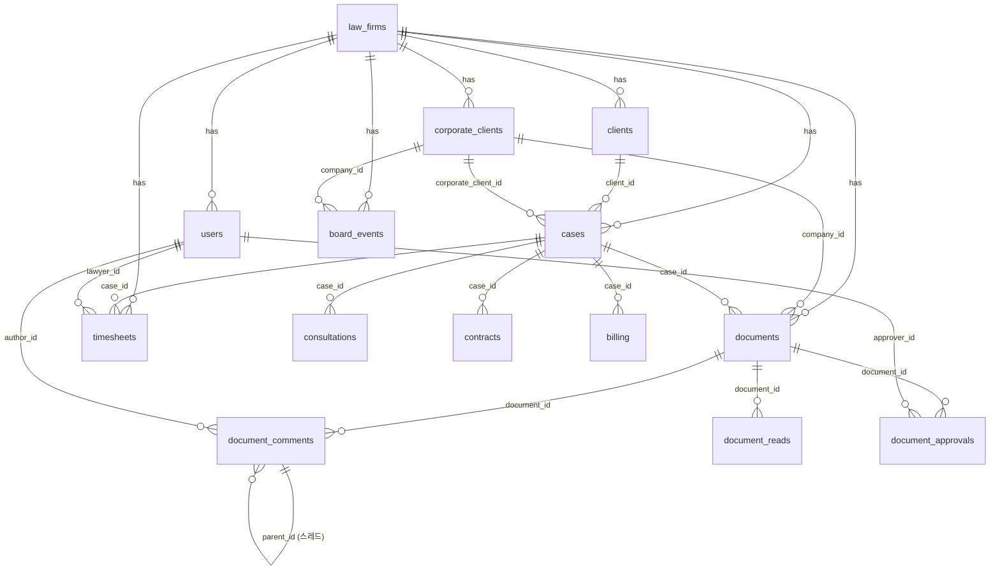

# 🏗️ Multi-Tenant 아키텍처 설계도
*(Supabase RLS 기반 법무법인 완전 격리 | 프로덕션 레벨 설계)*

> 연계 문서: [`DOCUMENT_COMMENT_SYSTEM.md`] | [`03_AUTOMATION_CATALOG.md`] | [`pm.md`]
> 마지막 업데이트: 2026-03-10 (v1.2 — DOCS 정합성 검증 완료)

---

## 1. 아키텍처 개요

```
┌─────────────────────────────────────────────────────────────────┐
│                     단일 코드베이스 (Next.js)                    │
├────────────┬────────────┬────────────┬──────────────────────────┤
│  로펌 A    │  로펌 B    │  로펌 C    │     슈퍼 어드민          │
│  테넌트    │  테넌트    │  테넌트    │    (우리 내부)           │
├────────────┴────────────┴────────────┴──────────────────────────┤
│              Supabase PostgreSQL (RLS 정책)                      │
│  ┌──────────────────────────────────────────────────────────┐   │
│  │  law_firm_id = A   │  law_firm_id = B   │  law_firm_id = C  │
│  └──────────────────────────────────────────────────────────┘   │
│              Storage (로펌별 버킷 격리)                          │
│  ┌──────────────────────────────────────────────────────────┐   │
│  │  documents/{law_firm_id}/cases/{case_id}/...             │
│  └──────────────────────────────────────────────────────────┘   │
└─────────────────────────────────────────────────────────────────┘
```

---

## 2. 역할(Role) 체계 — DOCS 매트릭스 완전 매핑

> DOCUMENT_COMMENT_SYSTEM.md의 역할 매트릭스와 1:1 대응

| DB role 값 | 진입 라우트 | 설명 | 주요 권한 |
|-----------|-----------|------|---------|
| `SUPER_ADMIN` | `/admin` | 우리 내부 운영팀 | RLS 우회, 전체 테넌트 접근 |
| `FIRM_ADMIN` | `/admin` | 각 로펌 대표변호사/관리자 | 해당 law_firm 전체 관리 |
| `PARTNER_LAWYER` | `/lawyer` | 파트너 변호사 | 전체 열람, 최종 승인, 배당 관리 |
| `LAWYER` | `/lawyer` | 담당 변호사 | 담당 사건, 1차 승인, TC/TM 입력 |
| `STAFF` | `/litigation` | 송무직원 | 담당 사건 수발신 문서, 기일 처리 |
| `SALES` | `/sales` | 영업팀 | 파이프라인, 계약 승인 |
| `SALES_MANAGER` | `/sales` | 영업팀 관리자 | 전체 파이프라인, 코멘트 분석 대시보드 |
| `CORP_HR` | `/company-hr` | 기업 HR 담당자 | 자사 사건만, @변호사 코멘트 |
| `CLIENT` | `/client-portal` | 개인 의뢰인 | 자신의 사건만 열람·기본 코멘트 |

> ⚠️ **RLS 적용 원칙**: `SUPER_ADMIN`은 service_role key로만 DB 접근 (Edge Function 내부). 나머지 모든 역할은 JWT `law_firm_id` 클레임으로 테넌트 격리.

---

## 3. JWT 커스텀 클레임 설계

```sql
-- Supabase Auth Hook: 로그인 시 JWT에 law_firm_id + user_role 자동 주입
CREATE OR REPLACE FUNCTION auth.custom_access_token_hook(event jsonb)
RETURNS jsonb LANGUAGE plpgsql AS $$
DECLARE
  claims jsonb;
  user_firm_id uuid;
  user_role text;
BEGIN
  SELECT law_firm_id, role
  INTO user_firm_id, user_role
  FROM public.users
  WHERE id = (event ->> 'user_id')::uuid;
  
  claims := event -> 'claims';
  claims := jsonb_set(claims, '{law_firm_id}', to_jsonb(user_firm_id::text));
  claims := jsonb_set(claims, '{user_role}', to_jsonb(user_role));
  
  RETURN jsonb_set(event, '{claims}', claims);
END;
$$;

GRANT EXECUTE ON FUNCTION auth.custom_access_token_hook TO supabase_auth_admin;
```

---

## 4. 전체 DB 스키마 (법무법인 특화 SQL)

> ⚠️ **설계 원칙**: 모든 테이블에 `law_firm_id UUID NOT NULL` 필수. DOCUMENT_COMMENT_SYSTEM.md의 DB 스키마와 완전 정합.

### 4-1. 핵심 운영 테이블

```sql
-- =====================================
-- 1. 로펌 (테넌트)
-- =====================================
CREATE TABLE law_firms (
  id                  uuid DEFAULT gen_random_uuid() PRIMARY KEY,
  name                text NOT NULL,
  plan                text DEFAULT 'basic' CHECK (plan IN ('basic','pro','growth','enterprise','trial')),
  subscription_status text DEFAULT 'trial' CHECK (subscription_status IN ('active','trial','paused','cancelled')),
  trial_ends_at       timestamptz DEFAULT NOW() + INTERVAL '30 days',
  max_lawyers         int DEFAULT 5,
  billing_email       text,
  created_at          timestamptz DEFAULT NOW()
);

-- =====================================
-- 2. 사용자 (변호사/직원/의뢰인)
-- =====================================
-- role 값은 섹션 2 역할 체계 표와 1:1 대응
CREATE TABLE users (
  id           uuid REFERENCES auth.users ON DELETE CASCADE PRIMARY KEY,
  law_firm_id  uuid REFERENCES law_firms ON DELETE CASCADE,
  role         text DEFAULT 'STAFF' CHECK (role IN (
    'SUPER_ADMIN','FIRM_ADMIN','PARTNER_LAWYER','LAWYER',
    'STAFF','SALES','SALES_MANAGER','CORP_HR','CLIENT'
  )),
  name         text NOT NULL,
  email        text UNIQUE NOT NULL,
  phone        text,
  bar_number   text,  -- 변호사 등록번호
  avatar_url   text,
  created_at   timestamptz DEFAULT NOW()
);

-- =====================================
-- 3. 개인 의뢰인 (CLIENT 역할 대응)
-- =====================================
CREATE TABLE clients (
  id                  uuid DEFAULT gen_random_uuid() PRIMARY KEY,
  law_firm_id         uuid REFERENCES law_firms ON DELETE CASCADE NOT NULL,
  type                text DEFAULT 'individual' CHECK (type IN ('individual','corporation')),
  name                text NOT NULL,
  company_name        text,
  registration_number text,  -- AES-256 암호화 저장
  contact_phone       text,
  contact_email       text,
  assigned_lawyer_id  uuid REFERENCES users,
  status              text DEFAULT 'active' CHECK (status IN ('active','closed','potential')),
  source              text CHECK (source IN ('referral','web','direct','ads','walk_in')),
  notes               text,
  created_at          timestamptz DEFAULT NOW()
);

-- =====================================
-- 3-B. 기업 의뢰인 (CORP_HR 역할 대응)
-- 개인 의뢰인(clients)과 분리 — 법인 전용 필드 포함
-- =====================================
CREATE TABLE corporate_clients (
  id              uuid DEFAULT gen_random_uuid() PRIMARY KEY,
  law_firm_id     uuid REFERENCES law_firms ON DELETE CASCADE NOT NULL,
  name            text NOT NULL,
  tier            text CHECK (tier IN ('A', 'B', 'C')),
  retainer_plan   text CHECK (retainer_plan IN ('Starter', 'Standard', 'Premium', 'Enterprise')),
  industry        text,
  employee_count  integer,
  revenue_range   text,
  assigned_lawyer uuid REFERENCES users,
  legal_contact   jsonb,                    -- {name, title, email}
  retainer_start  date,
  retainer_end    date,
  risk_score      decimal(3,1),             -- 0~10
  created_at      timestamptz DEFAULT NOW()
);

-- =====================================
-- 4. 사건 (핵심 테이블)
-- =====================================
-- client_id: 개인 의뢰인 참조 (기업 사건은 corporate_client_id 사용)
CREATE TABLE cases (
  id                   uuid DEFAULT gen_random_uuid() PRIMARY KEY,
  law_firm_id          uuid REFERENCES law_firms ON DELETE CASCADE NOT NULL,
  client_id            uuid REFERENCES clients ON DELETE RESTRICT,
  corporate_client_id  uuid REFERENCES corporate_clients ON DELETE RESTRICT,
  assigned_lawyer_id   uuid REFERENCES users,
  case_number          text,  -- 자동 생성: 2026-0001
  title                text NOT NULL,
  case_type            text CHECK (case_type IN ('civil','criminal','administrative','corporate','franchise','labor','real_estate','other')),
  status               text DEFAULT 'lead' CHECK (status IN ('lead','consulting','retained','active','closed','lost')),
  retainer_fee         numeric,  -- 착수금 (암호화)
  success_fee          numeric,  -- 성공보수 (암호화)
  opposing_party       text,     -- 상대방 (이해충돌 체크용)
  deadline_at          date,
  closed_at            timestamptz,
  priority             text DEFAULT 'medium' CHECK (priority IN ('high','medium','low')),
  notes                text,
  created_at           timestamptz DEFAULT NOW(),
  CONSTRAINT client_or_corporate CHECK (
    (client_id IS NOT NULL AND corporate_client_id IS NULL) OR
    (client_id IS NULL AND corporate_client_id IS NOT NULL)
  )
);

-- 사건 번호 자동 생성 (예: 2026-0001)
CREATE OR REPLACE FUNCTION generate_case_number()
RETURNS TRIGGER LANGUAGE plpgsql AS $$
DECLARE
  seq int;
BEGIN
  SELECT COUNT(*) + 1 INTO seq
  FROM cases
  WHERE law_firm_id = NEW.law_firm_id
    AND EXTRACT(YEAR FROM created_at) = EXTRACT(YEAR FROM NOW());
  NEW.case_number := EXTRACT(YEAR FROM NOW())::text || '-' || LPAD(seq::text, 4, '0');
  RETURN NEW;
END;
$$;
CREATE TRIGGER auto_case_number BEFORE INSERT ON cases
  FOR EACH ROW EXECUTE FUNCTION generate_case_number();

-- =====================================
-- 5. 상담 이력
-- =====================================
CREATE TABLE consultations (
  id              uuid DEFAULT gen_random_uuid() PRIMARY KEY,
  law_firm_id     uuid REFERENCES law_firms ON DELETE CASCADE NOT NULL,
  case_id         uuid REFERENCES cases ON DELETE CASCADE NOT NULL,
  client_id       uuid REFERENCES clients,
  lawyer_id       uuid REFERENCES users,
  channel         text CHECK (channel IN ('phone','visit','video','kakao','email')),
  summary         text NOT NULL,
  next_action     text,
  next_action_at  date,
  created_at      timestamptz DEFAULT NOW()
);

-- =====================================
-- 6. 계약/수임계약서
-- =====================================
CREATE TABLE contracts (
  id                uuid DEFAULT gen_random_uuid() PRIMARY KEY,
  law_firm_id       uuid REFERENCES law_firms ON DELETE CASCADE NOT NULL,
  case_id           uuid REFERENCES cases ON DELETE CASCADE NOT NULL,
  client_id         uuid REFERENCES clients,
  corporate_client_id uuid REFERENCES corporate_clients,
  title             text NOT NULL,
  status            text DEFAULT 'draft' CHECK (status IN ('draft','sent','signed','expired','cancelled')),
  signed_at         timestamptz,
  expires_at        date,
  document_url      text,
  esign_request_id  text,
  created_at        timestamptz DEFAULT NOW()
);

-- =====================================
-- 7. 수임료/청구
-- =====================================
CREATE TABLE billing (
  id            uuid DEFAULT gen_random_uuid() PRIMARY KEY,
  law_firm_id   uuid REFERENCES law_firms ON DELETE CASCADE NOT NULL,
  case_id       uuid REFERENCES cases ON DELETE CASCADE NOT NULL,
  client_id     uuid REFERENCES clients,
  corporate_client_id uuid REFERENCES corporate_clients,
  type          text CHECK (type IN ('retainer','success_fee','hourly','expense')),
  amount        numeric NOT NULL,
  status        text DEFAULT 'pending' CHECK (status IN ('pending','paid','overdue','cancelled')),
  due_date      date,
  paid_at       timestamptz,
  invoice_url   text,
  created_at    timestamptz DEFAULT NOW()
);

-- =====================================
-- 8. 문서 (DOCUMENT_COMMENT_SYSTEM.md 정합 버전)
-- =====================================
CREATE TABLE documents (
  id           uuid DEFAULT gen_random_uuid() PRIMARY KEY,
  law_firm_id  uuid REFERENCES law_firms ON DELETE CASCADE NOT NULL,  -- ★ RLS 기준
  case_id      uuid REFERENCES cases ON DELETE CASCADE,
  company_id   uuid REFERENCES corporate_clients,  -- 기업 법인 전용 문서
  title        text NOT NULL,
  doc_type     text CHECK (doc_type IN (
    'contract', 'court_filing', 'opinion',
    'board_minutes', 'director_appointment',
    'shareholder_notice', 'officer_contract',
    'retainer_report', 'closure_report',
    'timecost_invoice', 'compliance_report'
  )),
  file_url     text NOT NULL,               -- Supabase Storage 경로
  file_type    text,
  file_size    bigint,
  version      integer DEFAULT 1,
  status       text DEFAULT 'draft' CHECK (status IN ('draft','reviewing','approved','rejected','sent')),
  urgency      text DEFAULT 'normal' CHECK (urgency IN ('normal','urgent','critical')),
  doc_source   text CHECK (doc_source IN ('our_filing','opponent','court','internal')),  -- 로탑 생성주체 분류
  uploaded_by  uuid REFERENCES users,
  created_at   timestamptz DEFAULT NOW()
);

-- =====================================
-- 9. 문서 코멘트 (스레드 구조)
-- =====================================
CREATE TABLE document_comments (
  id              uuid DEFAULT gen_random_uuid() PRIMARY KEY,
  law_firm_id     uuid REFERENCES law_firms ON DELETE CASCADE NOT NULL,  -- ★ RLS 기준
  document_id     uuid REFERENCES documents ON DELETE CASCADE NOT NULL,
  parent_id       uuid REFERENCES document_comments,  -- NULL = 루트 코멘트
  author_id       uuid REFERENCES users NOT NULL,
  comment_type    text DEFAULT 'general' CHECK (comment_type IN (
    'general', 'approval', 'revision_request', 'notice'
  )),
  content         text NOT NULL,
  attachment_url  text,
  tagged_users    uuid[],                    -- @태그된 사용자 ID 배열
  page_ref        integer,                   -- PDF 몇 페이지
  text_ref        text,                      -- 선택된 텍스트 구절
  due_date        timestamptz,               -- /due [날짜] 단축키 대응
  is_resolved     boolean DEFAULT FALSE,
  resolved_by     uuid REFERENCES users,
  resolved_at     timestamptz,
  created_at      timestamptz DEFAULT NOW(),
  updated_at      timestamptz DEFAULT NOW()
);

-- =====================================
-- 10. 문서 읽음 추적
-- =====================================
CREATE TABLE document_reads (
  document_id  uuid REFERENCES documents ON DELETE CASCADE,
  user_id      uuid REFERENCES users ON DELETE CASCADE,
  law_firm_id  uuid REFERENCES law_firms ON DELETE CASCADE NOT NULL,  -- ★ RLS 기준
  read_at      timestamptz DEFAULT NOW(),
  PRIMARY KEY (document_id, user_id)
);

-- =====================================
-- 11. 문서 승인 이력
-- =====================================
-- approval_type 순서: lawyer_1st → partner_final (일반 결재 라인)
--                    sales_contract (영업팀 계약 한정)
--                    admin_override (Super Admin 우회 결재)
CREATE TABLE document_approvals (
  id            uuid DEFAULT gen_random_uuid() PRIMARY KEY,
  law_firm_id   uuid REFERENCES law_firms ON DELETE CASCADE NOT NULL,  -- ★ RLS 기준
  document_id   uuid REFERENCES documents ON DELETE CASCADE NOT NULL,
  approver_id   uuid REFERENCES users NOT NULL,
  approval_type text CHECK (approval_type IN (
    'lawyer_1st', 'partner_final', 'sales_contract', 'admin_override'
  )),
  approved_at   timestamptz DEFAULT NOW(),
  comment       text,
  legal_binding boolean DEFAULT TRUE
);

-- =====================================
-- 12. 이사사업 전용 테이블
-- =====================================
CREATE TABLE board_events (
  id             uuid DEFAULT gen_random_uuid() PRIMARY KEY,
  law_firm_id    uuid REFERENCES law_firms ON DELETE CASCADE NOT NULL,  -- ★ RLS 기준
  company_id     uuid REFERENCES corporate_clients ON DELETE CASCADE NOT NULL,
  event_type     text CHECK (event_type IN (
    'director_appoint', 'director_resign', 'shareholder_meeting'
  )),
  director_name  text,
  effective_date date,
  term_expiry    date,
  auto_docs      jsonb,   -- 자동 생성된 document_id 배열
  status         text DEFAULT 'upcoming' CHECK (status IN (
    'upcoming', 'in_progress', 'completed', 'registered'
  )),
  created_at     timestamptz DEFAULT NOW()
);

-- =====================================
-- 13. 타임시트 (TC/TM — 로탑 개념 통합)
-- =====================================
CREATE TABLE timesheets (
  id            uuid DEFAULT gen_random_uuid() PRIMARY KEY,
  law_firm_id   uuid REFERENCES law_firms ON DELETE CASCADE NOT NULL,  -- ★ RLS 기준
  case_id       uuid REFERENCES cases ON DELETE CASCADE NOT NULL,
  lawyer_id     uuid REFERENCES users NOT NULL,
  work_date     date NOT NULL,
  base_hours    decimal(5,2),
  extra_hours   decimal(5,2),
  discount_rate decimal(5,2),
  charge_type   text CHECK (charge_type IN ('TC', 'TM', 'flat')),
  invoice_sent  boolean DEFAULT FALSE,
  created_at    timestamptz DEFAULT NOW()
);

-- =====================================
-- 14. 자동화 로그
-- =====================================
CREATE TABLE automation_logs (
  id                 uuid DEFAULT gen_random_uuid() PRIMARY KEY,
  law_firm_id        uuid REFERENCES law_firms ON DELETE CASCADE NOT NULL,
  trigger_type       text NOT NULL,
  target_entity_id   uuid,
  target_entity_type text,
  sent_channel       text CHECK (sent_channel IN ('kakao','email','sms','push')),
  status             text DEFAULT 'sent' CHECK (status IN ('sent','failed','skipped')),
  error_message      text,
  created_at         timestamptz DEFAULT NOW()
);
```

---

## 5. RLS 정책 전체 적용

```sql
-- =============================================
-- 패턴: 모든 테이블 동일 구조 적용
-- 적용 대상: law_firms, users, clients, corporate_clients,
--            cases, consultations, contracts, billing,
--            documents, document_comments, document_reads,
--            document_approvals, board_events, timesheets,
--            automation_logs
-- =============================================

-- 예시: documents 테이블 (가장 복잡한 케이스)
ALTER TABLE documents ENABLE ROW LEVEL SECURITY;

-- [정책 1] 일반 사용자: 자신의 로펌 데이터만
CREATE POLICY "firm_isolation" ON documents
  USING (law_firm_id = (auth.jwt() ->> 'law_firm_id')::uuid);

-- [정책 2] 기업 HR(CORP_HR): 자사 company_id 문서만
CREATE POLICY "corp_hr_own_company" ON documents
  FOR SELECT USING (
    (auth.jwt() ->> 'user_role') = 'CORP_HR' AND
    company_id IN (
      SELECT id FROM corporate_clients
      WHERE assigned_lawyer = auth.uid()
        OR id IN (
          SELECT corporate_client_id FROM cases
          WHERE assigned_lawyer_id = auth.uid()
        )
    )
  );

-- [정책 3] 개인 의뢰인(CLIENT): 자신의 사건 문서만
CREATE POLICY "client_own_docs" ON documents
  FOR SELECT USING (
    (auth.jwt() ->> 'user_role') = 'CLIENT' AND
    case_id IN (
      SELECT id FROM cases WHERE client_id = auth.uid()
    )
  );

-- [정책 4] SUPER_ADMIN: service_role key로만 접근 (RLS 우회)
-- Edge Function 내부에서만 createAdminClient() 사용

-- document_comments 테이블
ALTER TABLE document_comments ENABLE ROW LEVEL SECURITY;
CREATE POLICY "firm_isolation" ON document_comments
  USING (law_firm_id = (auth.jwt() ->> 'law_firm_id')::uuid);

-- document_approvals 테이블
ALTER TABLE document_approvals ENABLE ROW LEVEL SECURITY;
CREATE POLICY "firm_isolation" ON document_approvals
  USING (law_firm_id = (auth.jwt() ->> 'law_firm_id')::uuid);

-- board_events 테이블
ALTER TABLE board_events ENABLE ROW LEVEL SECURITY;
CREATE POLICY "firm_isolation" ON board_events
  USING (law_firm_id = (auth.jwt() ->> 'law_firm_id')::uuid);

-- timesheets 테이블
ALTER TABLE timesheets ENABLE ROW LEVEL SECURITY;
CREATE POLICY "firm_isolation" ON timesheets
  USING (law_firm_id = (auth.jwt() ->> 'law_firm_id')::uuid);

-- cases 테이블 (기존 유지)
ALTER TABLE cases ENABLE ROW LEVEL SECURITY;
CREATE POLICY "firm_isolation" ON cases
  USING (law_firm_id = (auth.jwt() ->> 'law_firm_id')::uuid);
CREATE POLICY "client_own_cases" ON cases
  FOR SELECT USING (
    (auth.jwt() ->> 'user_role') = 'CLIENT' AND
    client_id = auth.uid()
  );
```

---

## 6. Supabase Storage 버킷 구조 (DOCS 정합 버전)

```
버킷: documents
경로 구조:
  documents/
    {law_firm_id}/               ← RLS 격리 기준
      cases/
        {case_id}/
          our_filing/            ← doc_source = 'our_filing'
            계약서.pdf
            준비서면.docx
          opponent/              ← doc_source = 'opponent'
            답변서.pdf
          court/                 ← doc_source = 'court'
            기일통보서.pdf
          internal/              ← doc_source = 'internal'
            수임리포트_자동생성.pdf
            상담록_AI음성인식.txt
      corporate/
        {corporate_client_id}/   ← 기업 법인 전용
          board_minutes/
          compliance/
      templates/                 ← 로펌 공용 서식 (3,000+ 종)
        수임계약서_기본.docx

Storage RLS 정책:
  SELECT: (storage.foldername(name))[1] = JWT law_firm_id 일치 시만 허용
  INSERT: (storage.foldername(name))[1] = JWT law_firm_id 일치 시만 허용
  DELETE: FIRM_ADMIN, PARTNER_LAWYER 이상만 허용
```

```sql
-- Storage 버킷 RLS (SQL)
CREATE POLICY "firm_storage_isolation" ON storage.objects
  FOR SELECT USING (
    bucket_id = 'documents' AND
    auth.jwt() ->> 'law_firm_id' = (storage.foldername(name))[1]
  );

CREATE POLICY "firm_storage_insert" ON storage.objects
  FOR INSERT WITH CHECK (
    bucket_id = 'documents' AND
    auth.jwt() ->> 'law_firm_id' = (storage.foldername(name))[1]
  );

CREATE POLICY "firm_storage_delete" ON storage.objects
  FOR DELETE USING (
    bucket_id = 'documents' AND
    auth.jwt() ->> 'law_firm_id' = (storage.foldername(name))[1] AND
    auth.jwt() ->> 'user_role' IN ('FIRM_ADMIN', 'PARTNER_LAWYER', 'SUPER_ADMIN')
  );
```

---

## 7. 테이블 간 관계 다이어그램



---

## 8. 온보딩 자동화 (신규 로펌 생성 플로우)

```typescript
// POST /api/super-admin/firms
// 신규 로펌 onboarding 자동화 트리거

export async function onboardNewFirm(firmData: {
  name: string; adminEmail: string; plan: string
}) {
  const supabase = createAdminClient() // service_role key

  // 1. law_firms 레코드 생성
  const { data: firm } = await supabase
    .from('law_firms')
    .insert({ name: firmData.name, plan: firmData.plan })
    .select().single()

  // 2. Supabase Auth 계정 생성 (FIRM_ADMIN)
  const { data: authUser } = await supabase.auth.admin.createUser({
    email: firmData.adminEmail,
    app_metadata: { law_firm_id: firm.id, user_role: 'FIRM_ADMIN' }
  })

  // 3. users 테이블 레코드 생성
  await supabase.from('users').insert({
    id: authUser.user.id,
    law_firm_id: firm.id,
    role: 'FIRM_ADMIN',
    email: firmData.adminEmail,
    name: 'Admin'
  })

  // 4. Storage 버킷 초기 폴더 구조 생성
  await supabase.storage.from('documents')
    .upload(`${firm.id}/.gitkeep`, new Blob([]))
  await supabase.storage.from('documents')
    .upload(`${firm.id}/cases/.gitkeep`, new Blob([]))
  await supabase.storage.from('documents')
    .upload(`${firm.id}/templates/.gitkeep`, new Blob([]))

  // 5. 웰컴 이메일 발송 (Supabase Edge Function)
  await supabase.functions.invoke('send-welcome-email', {
    body: { firmId: firm.id, email: firmData.adminEmail }
  })
}
```

---

## 9. 이해충돌 자동 체크 (신건 등록 / 문서 공유 시)

```sql
-- 이해충돌 체크 함수
-- cases.opposing_party vs clients/corporate_clients.name 교차 검사
CREATE OR REPLACE FUNCTION check_conflict_of_interest(
  p_law_firm_id uuid,
  p_opposing_party text,
  p_new_client_name text DEFAULT NULL
)
RETURNS TABLE(conflict_case_id uuid, conflict_case_title text, reason text)
LANGUAGE plpgsql SECURITY DEFINER AS $$
BEGIN
  -- [1] 새 사건의 상대방이 기존 의뢰인인지 검사
  RETURN QUERY
  SELECT c.id, c.title, '상대방이 기존 의뢰인과 동일' as reason
  FROM cases c
  JOIN clients cl ON cl.id = c.client_id
  WHERE c.law_firm_id = p_law_firm_id
    AND c.status NOT IN ('closed', 'lost')
    AND cl.name ILIKE '%' || p_opposing_party || '%';

  -- [2] 새 의뢰인이 기존 사건의 상대방인지 검사
  IF p_new_client_name IS NOT NULL THEN
    RETURN QUERY
    SELECT c.id, c.title, '신규 의뢰인이 기존 사건 상대방과 동일' as reason
    FROM cases c
    WHERE c.law_firm_id = p_law_firm_id
      AND c.status NOT IN ('closed', 'lost')
      AND c.opposing_party ILIKE '%' || p_new_client_name || '%';
  END IF;
END;
$$;
```

---

## 10. 환경별 접근 권한 요약

| 환경 | Supabase 키 | RLS 적용 | 사용 위치 |
|------|-----------|---------|---------|
| 클라이언트 (Next.js) | `anon key` | ✅ JWT 기반 완전 적용 | 브라우저 |
| 서버 컴포넌트 | `service_role key` | ⚠️ RLS 우회 — 반드시 로직 내 law_firm_id 필터 수동 적용 | API Routes, Edge Functions |
| Super Admin 패널 | `service_role key` | ⚠️ RLS 우회 — 전체 테넌트 접근 | `/admin` 서버 사이드만 |
| Supabase Edge Functions | `service_role key` | ⚠️ RLS 우회 — 자동화 전용 | 웹훅, CRON 트리거 |

> ⚠️ **CRITICAL**: `service_role key`는 절대 클라이언트(브라우저)에 노출 금지. `.env.local`에서 `SUPABASE_SERVICE_ROLE_KEY`로만 관리.
