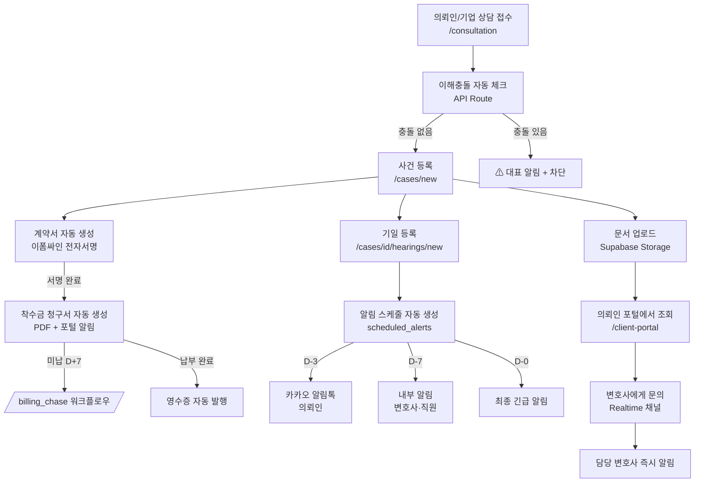

# 🏛️ 클라이언트 관리 + 송무시스템 — 완전 통합 마스터 문서
**LAWTOP IA 벤치마크 + 현재 사이트 분석 + 구현 로드맵 완전 통합**

> 작성일: 2026-03-10 | 최종 업데이트: 2026-03-10 | 기반 문서: `LAWTOP_IA_DEEP_RESEARCH.md` + 현재 사이트 소스 분석  
> 현재 스택: Next.js 14 (App Router) + TypeScript + Framer Motion + Supabase  
> 현재 로펌: IBS 법률사무소 (프랜차이즈 전문)
> **✅ 2026-03-10 업데이트**: 개인 의뢰인 송무관리 시스템 추가 (`/my-cases`, `/my-cases/[id]`, `/litigation` 개인탭)

## 📊 PM 진행 현황

| 항목 | 상태 | 비고 |
|------|------|------|
| **전체 구현 완성도** | 🟡 **3%** | UI 레이어 + 개인의뢰인 송무관리 UI 완성 |
| **개인 의뢰인 송무 UI** | ✅ **완료** | `/my-cases`, `/my-cases/[id]`, litigation 개인탭 구현 |
| Phase 0 (DB 인프라) | ⬜ 0% | Supabase Auth·RLS·mockStore 마이그레이션 미시작 |
| Phase 1 (MVP 핵심) | ⬜ 0% | 대시보드·기일알림·클라이언트포털 DB 연동 미시작 |
| Phase 2 (완성도) | ⬜ 0% | 카카오·전자서명·청구서 미시작 |
| Phase 3 (AI 우위) | ⬜ 0% | 판례검색·계약서 AI 미시작 |

> [!NOTE]
> **3% 기준**: UI/UX 프레임(25개) + 개인의뢰인 송무라우트(2개) + 개인탭 연동 완성. 핵심 백엔드(Supabase DB·Auth·RLS·자동화)가 전부 미연동 상태.

**다음 마일스톤**: Phase 0 완료 → **10%** 달성 목표 (예상 소요: 2주)

---

## 🗺️ 1. 현재 사이트 구현 현황 전수 조사

### ✅ 이미 구현된 페이지/기능 (27개 라우트)

| 라우트 | 기능명 | 완성도 | 비고 |
|--------|--------|--------|------|
| `/` | 메인 랜딩 | ✅ 90% | HeroSection·IssueSection·RiskSection·ServicesSection·PricingSection·FAQSection |
| `/dashboard` | 고객사 대시보드 | ✅ 80% | 7단계 진행바, 이슈 목록, AI 검토 시뮬 |
| `/admin` | 영업팀 CRM | ✅ 80% | 파이프라인, 라운드로빈 변호사 배정, 콜 메모 |
| `/lawyer` | 변호사 대시보드 | ✅ 70% | 개인정보검토 큐, 가맹상담 큐, AI초안 비교패널 |
| `/litigation` | **송무팀 사건관리** | ✅ 80% | 기업/개인 탭, 사건 테이블, 기한 배지, 상태 필터, 노트·결과 기록 |
| `/client-portal` | 기업 의뢰인 포털 | ✅ 60% | 개인정보검토 리포트 (RLS pending) |
| **`/my-cases`** | **개인 의뢰인 포털** | ✅ **75%** | **형사·민사·이혼·노동 분류탭, 기일D-Day, QR결제링크** |
| **`/my-cases/[id]`** | **개인 사건 상세** | ✅ **75%** | **타임라인, 기일목록, 청구서, QR결제, 변호사연락** |
| `/consultation` | 상담 접수 | ✅ 80% | 카테고리·긴급도 분기, AI분석 시뮬 |
| `/contracts` | 계약 관리 | ✅ 구현중 | 전자서명 연동 예정 |
| `/notifications` | 알림 | ⚠️ 30% | UI만 있고 실제 발송 연동 없음 |
| `/employee` | 임직원 포털 | ✅ 60% | 역할별 접근, 자료실 |
| `/company-hr` | 기업 HR 대시보드 | 🔄 진행중 | 기업 법인 전용 |
| `/franchise` | 프랜차이즈 모듈 | 🔄 진행중 | 가맹점 분쟁 특화 |
| `/counselor` | 상담사 화면 | 구현중 | — |
| `/sales` | 영업 파이프라인 | 구현중 | — |
| `/onboarding` | 신규 로펌 온보딩 | 구현중 | — |
| `/pricing` | 요금제 | ✅ | 퍼블릭 요금표 |
| `/login` `/signup` | 인증 | ⚠️ UI만 | 실제 Supabase Auth 미연동 |
| `/profile` `/settings` | 계정 관리 | UI만 | — |
| `/about` `/help` | 정적 페이지 | 완료 | — |
| `/legal` | 법적 고지 | 완료 | — |

### ⚠️ 현재 가장 큰 GAP (미구현 핵심)

```
❌ Supabase DB 연동 — 현재 전부 localStorage mockStore
❌ 실제 인증 (Supabase Auth + RLS) — UI만 있고 인증 없음
❌ 카카오 알림톡 실제 발송 — 스펙 설계만 완료
❌ 기일 자동 알림 스케줄러 (pg_cron) — 설계만 완료
❌ 대법원 기일 자동 연동 API
❌ 의뢰인 포털 ↔ 내부 시스템 실시간 연동 (Supabase Realtime)
```

---

## ⚖️ 2. 로탑 IA 벤치마크 — 우리가 반드시 이겨야 하는 지점

### 핵심 차별화 포인트 (우리 우세)

| 항목 | 로탑 IA | 우리 플랫폼 | 영업 멘트 |
|------|---------|-----------|---------|
| **아키텍처** | C/S 설치형 (.exe) | ✅ 웹 SaaS (브라우저) | "설치 없이 지금 바로" |
| **멀티테넌트** | ❌ | ✅ Supabase RLS | "다른 로펌 데이터 완전 격리" |
| **AI 기능** | STT 1개 | ✅ AI어시스턴트·판례검색·계약서리뷰 | "AI가 변호사를 1.7배 빠르게" |
| **카카오 알림톡** | ❌ (SMS만) | ✅ 알림톡+읽음확인+버튼 | "의뢰인이 실제로 확인" |
| **전자서명** | ❌ | ✅ 이폼싸인 연동 | "계약서 도장→원격 1분" |
| **요금 투명성** | ❌ 협의 | ✅ 퍼블릭 요금표 | "숨은 비용 없음" |
| **무료 체험** | ❌ PT 필요 | ✅ 즉시 Free Trial | "지금 바로 시작" |
| **모던 디자인** | ❌ 구식 UI | ✅ 프리미엄 UI | "변호사도 아이폰 쓴다" |

### 로탑 우세 영역 (추격 필요)

| 항목 | 로탑 | 추격 계획 |
|------|------|---------|
| 손해배상 자동계산 (자·산·의·기) | ✅ 완성 | Phase 2 구현 |
| 법률 서식 3,000종 | ✅ | 최소 1,000종 확보 |
| 대법원 기일 자동 연동 | ✅ | Phase 1 필수 |
| 10년 검증된 신뢰도 | ✅ | 고객 사례 누적 전략 |

---

## 🏗️ 3. 클라이언트 관리 송무시스템 — 완전 기능 정의

### 📊 3-1. 사건(케이스) 관리 모듈 — 현재 `/litigation/page.tsx` 기반

#### 현재 구현된 것 (mockStore 기반)
```typescript
interface LitigationCase {
  id: string
  companyId: string          // 의뢰인 기업 ID
  companyName: string        // 의뢰인명
  caseNo: string             // 사건번호 (2026가합12345)
  court: string              // 법원명
  type: string               // 민사·형사·행정·가사
  opponent: string           // 상대방
  claimAmount: number        // 청구금액 (원)
  status: LitigationStatus   // preparing|filed|hearing|settlement|judgment|closed
  assignedLawyer: string     // 담당 변호사
  deadlines: LitigationDeadline[]  // 기한 목록
  notes: string              // 사건 메모
  result: '승소'|'패소'|'합의'|'취하'|''  // 결과
  resultNote: string         // 결과 상세
}
```

#### 추가 구현 필요 (DB 전환 시)
```sql
-- 현재 mockStore → Supabase 전환 시 추가 필드
ALTER TABLE cases ADD COLUMN IF NOT EXISTS
  is_immutable BOOLEAN DEFAULT FALSE,   -- 불변기일 여부
  case_type TEXT CHECK (case_type IN ('civil','criminal','family','admin','franchise','labor')),
  tenant_id UUID REFERENCES law_firms(id),   -- ⚠️ law_firm_id → tenant_id (RLS 통일 키)
  client_id UUID REFERENCES clients(id),
  attorney_id UUID REFERENCES users(id),
  opponent_name TEXT,
  filing_date DATE,
  next_hearing_at TIMESTAMPTZ,
  court_case_number TEXT;              -- 대법원 공식 사건번호

-- RLS: tenant 격리 (tenant_id = JWT claim 'tenant_id')
ALTER TABLE cases ENABLE ROW LEVEL SECURITY;
CREATE POLICY "tenant_isolation" ON cases
  USING (tenant_id = (auth.jwt() ->> 'tenant_id')::uuid);
```

#### 사건 상태 플로우 (확장)
```
상담중(intake) 
  → 이해충돌 체크 자동 실행
  → 수임(retained) 
    → 계약서 자동 생성 + 전자서명 요청
    → 착수금 청구서 자동 생성
  → 진행중(active) 
    → 기일 등록 → 알림 스케줄 자동 생성
    → 서면 작성 · 문서 등록
  → 종결 준비(closing)
    → 종결 결과 입력 (승소/패소/합의/취하)
  → 종결(closed)
    → 성과분석 · 통계 자동 기록
```

---

### 📅 3-2. 기일 관리 모듈 (현재 가장 중요한 GAP)

#### 현재 상태: `/litigation`에서 DeadlneBadge 컴포넌트로 UI만 구현

#### 완전 구현 스펙

**기일 등록 화면** (`/cases/{id}/hearings/new`)
```
입력 필드:
  - 기일 종류: 변론·준비·조정·화해·선고
  - 날짜/시각 (YYYY-MM-DD HH:mm)
  - 법원명 + 법정 호수
  - 불변기일 토글 → ON시 D-14 경고 자동 추가
  - 의뢰인 알림 발송 여부 (기본 ON)
  - 변호사 메모 (준비사항 안내)
```

**자동 알림 스케줄 (hearings INSERT 시 자동 생성)**
```
불변기일: D-14  → 대표 변호사 CC 포함 카카오 알림톡 (빨간 배지)
일반기일: D-7   → 담당 변호사 앱 푸시 + 직원 대시보드 알림
         D-3   → 의뢰인 카카오 알림톡 자동 발송
         D-1   → 변호사 앱 푸시 + SMS fallback
         D-0   → 오전 9시 담당 변호사 최종 알림
```

**카카오 알림톡 템플릿** (`HEARING_NOTICE_D3`)
```
[IBS법률사무소] #{client_name}님,
#{hearing_type}이 3일 후입니다.

📅 일시: #{hearing_date}
🏛️ 법원: #{court_name}
👔 담당: #{attorney} 변호사

[기일 상세 확인] → /portal/hearings/{id}
```

**DB 스키마**
> ⚠️ 아래는 참고용 요약. 최종 스키마는 **섹션 5** `hearings` 테이블 정의를 기준으로 한다.
```sql
CREATE TABLE hearings (
  id            UUID PRIMARY KEY DEFAULT gen_random_uuid(),
  case_id       UUID REFERENCES cases(id) ON DELETE CASCADE,
  tenant_id     UUID REFERENCES law_firms(id),   -- ← RLS 통일 키 (law_firm_id 사용 금지)
  hearing_type  TEXT CHECK (hearing_type IN ('pleading','preparation','mediation','conciliation','judgment')),
  hearing_at    TIMESTAMPTZ NOT NULL,
  court_name    TEXT,
  courtroom     TEXT,
  is_immutable  BOOLEAN DEFAULT FALSE,
  attorney_memo TEXT,
  created_by    UUID REFERENCES users(id),
  created_at    TIMESTAMPTZ DEFAULT NOW()
);

CREATE TABLE scheduled_alerts (
  id             UUID PRIMARY KEY DEFAULT gen_random_uuid(),
  hearing_id     UUID REFERENCES hearings(id) ON DELETE CASCADE,
  case_id        UUID REFERENCES cases(id),
  tenant_id      UUID REFERENCES law_firms(id),
  alert_type     TEXT CHECK (alert_type IN ('internal','kakao','sms','immutable_warning')),
  target_type    TEXT CHECK (target_type IN ('attorney','staff','client','all')),
  target_user_id UUID,
  scheduled_at   TIMESTAMPTZ NOT NULL,
  sent           BOOLEAN DEFAULT FALSE,
  sent_at        TIMESTAMPTZ,
  retry_count    INT DEFAULT 0
);

-- pg_cron: 매일 09:00 KST 발송
SELECT cron.schedule('daily-alert-dispatch', '0 0 * * *', $$
  SELECT dispatch_scheduled_alerts();
$$);
```

---

### 👥 3-3. 클라이언트(의뢰인) 관리 모듈

#### RBAC 역할 체계

> ⚠️ **역할 코드 기준: `pm.md` 통일 적용** — DB schema의 CHECK 제약도 아래 코드와 일치해야 함.

| 역할 | 코드 | 접근 가능 화면 | 권한 |
|------|------|--------------|------|
| 대표변호사 | `FIRM_ADMIN` | 전체 | 전체 조회·수정·배정·통계 |
| 파트너변호사 | `PARTNER_LAWYER` | 전체 사건 + 최종결재 | 사건 등록·결재·통계 |
| 담당변호사 | `LAWYER` | 내 사건 + 공유 | 사건 등록·기일·메모 |
| 송무직원 | `STAFF` | 전체 진행 사건 | 상태변경·알림발송·문서 |
| 영업팀(일반) | `SALES` | CRM 파이프라인 | 읽기 전용 (사건 내용 불가) |
| 영업관리자 | `SALES_MANAGER` | CRM + 계약결재 | 계약 발송·결재 |
| 의뢰인 | `CLIENT` | /client-portal, /my-cases | 내 사건만 |
| 기업 HR | `CORP_HR` | /company-hr, /client-portal | 자사 법인 전체 |
| 슈퍼관리자 | `SUPER_ADMIN` | 전체 로펌 | 플랫폼 전체 관리 |

#### 의뢰인 포털 필수 기능

```
/client-portal 화면 구성:
  ① 액션 필요 배지 (서명 대기·서류 제출 요청·납부 대기)
  ② 내 사건 목록 (사건명·상태 진행바·다음 기일·담당변호사)
  ③ 사건 상세
      → 타임라인 (접수→수임→진행→종결 이력)
      → 기일 목록 (날짜·법원·준비사항)
      → 문서함 (업로드·다운로드)
      → 청구서·수납 내역
  ④ 변호사에게 문의 (메시지 채널)
  ⑤ 기업 전용: 월간 법무 리포트 열람
```

---

### 💰 3-4. 수임료 청구·미수 관리 모듈

```
수임 계약 서명 완료 → 착수금 청구서 자동 생성 (PDF)
  → 의뢰인 이메일 + 포털 알림
  → due_date = 서명일 + 7일

미납 에스컬레이션 (pg_cron 매일):
  D+1: 의뢰인 카카오 알림톡 "납부 안내"
  D+7: 변호사 + 의뢰인 동시 이메일 + 담당 직원 대시보드 경고
  D+30: 법적 조치 안내 문자 + 대표변호사 에스컬레이션 카카오
  → billing_chase 워크플로우 연동 (/billing_chase)
```

---

### 📄 3-5. 문서·코멘트 시스템 (Sticky Feature)

> 상세 구현 스펙: `DocComment Vibe Prompt` | DB 스키마: `_strategy/DOCUMENT_COMMENT_SYSTEM.md`  
> **Sprint B (DocComment) → Sprint B-2 (의뢰 워크플로우) → Sprint C (Esign)** 순서로 진행

#### 🟢 MVP — Sprint B·B-2 즉시 구현 대상
```
  - 사건별 문서함 (드래그 앤 드롭 업로드)
  - 생성주체 자동 분류: 우리 제출 / 상대 제출 / 법원 문건 / 내부 생성
  - 인라인 코멘트 스레드 (4가지 유형: 📌일반 / ✅승인 / ⚠️수정요청 / 🔔공지)
  - 변호사 ↔ 의뢰인 코멘트 권한 분리 (@멘션 + 자동완성)
  - 문서 의뢰 워크플로우 (기업고객 신청 → 내부팀 처리 → 전달)
```

#### 🟡 SHOULD — Phase 2 이후 추가
```
  - OCR 자동 변환 (스캔→검색 가능 PDF)
  - 전문 검색 (파일명·본문·작성자·날짜)
  - Esign 전자계약 ↔ documents 테이블 역방향 자동 INSERT
```

---

## 🛣️ 4. 즉시 구현 로드맵 (Priority Matrix)

### 🔴 Phase 0 — 즉시 (0~2주): 기반 인프라

| 작업 | 파일/테이블 | 이유 |
|------|-----------|------|
| Supabase Auth 연동 | `/login`, `/signup` | 현재 인증 없음 = 모든 기능 블로킹 |
| mockStore → Supabase 마이그레이션 | `cases`, `hearings`, `clients` | DB 없으면 아무것도 안 됨 |
| RLS 정책 적용 | 전체 테이블 | 멀티테넌트 격리 필수 |
| `workflow_rules` 테이블 생성 | Supabase | 자동화 기반 |
| RBAC 미들웨어 | `middleware.ts` | 역할별 라우팅 |

### 🟠 Phase 1 — 단기 (2~4주): MVP 핵심

| 작업 | 파일 | 우선순위 근거 |
|------|------|------------|
| **통합 사건 대시보드** | `/dashboard/page.tsx` 고도화 | LAWTOP 분석 10/10점 |
| **자동 기일 알림** | Edge Function + pg_cron | LAWTOP 분석 9/10점 |
| 의뢰인 포털 DB 연동 | `/client-portal/page.tsx` | 차별화 포인트 |
| 이해충돌 자동 체크 | API Route | 법적 필수 |
| 사건 타임라인 자동 기록 | `case_timeline` 테이블 | 투명성 |

### 🟡 Phase 2 — 중기 (1~2개월): 완성도

| 작업 | 파일 | 비고 |
|------|------|------|
| 카카오 알림톡 연동 | Edge Function | 로탑 대비 차별화 |
| **전자서명 Sprint C** | `/admin/contracts`, `Esign Vibe Prompt` | **Sprint B 완료 직후 시작** (DocComment→Esign 연동 포함) |
| 수임료 청구서 자동 생성 | PDF + billing 모듈 | 로탑 동등 수준 |
| 손해배상 계산기 | 별도 모듈 | 로탑 추격 |

### 🟢 Phase 3 — 장기 (2~4개월): AI 우위

| 작업 | 비고 |
|------|------|
| AI 판례 검색 (RAG) | 슈퍼로이어 대항마 |
| 계약서 AI 리뷰 | B2B SaaS 차별화 |
| 법률 서식 라이브러리 (1,000종) | 로탑 추격 |
| 대법원 기일 자동 연동 API | 로탑 동등 수준 |
| PWA / 모바일 앱 | 로탑 C/S 대항 |

---

## 🗄️ 5. 완전 DB 스키마 (Supabase)

> ⚠️ **RLS 키 원칙**: 모든 테이블에서 `tenant_id`를 사용. `law_firm_id` 컬럼명 사용 금지.  
> JWT claim 키도 `tenant_id` 로 통일 (`auth.jwt() ->> 'tenant_id'`).  
> 역할 코드는 `pm.md` 기준 (`LAWYER`, `PARTNER_LAWYER`, `SALES_MANAGER` 포함).

```sql
-- ─────────────────────────────────────
-- 1. 법무법인 (멀티테넌트 루트)
-- ─────────────────────────────────────
CREATE TABLE law_firms (
  id           UUID PRIMARY KEY DEFAULT gen_random_uuid(),
  name         TEXT NOT NULL,
  plan         TEXT CHECK (plan IN ('free','starter','professional','enterprise')),
  created_at   TIMESTAMPTZ DEFAULT NOW()
);

-- ─────────────────────────────────────
-- 2. 사용자 (RBAC)
-- ─────────────────────────────────────
CREATE TABLE users (
  id          UUID PRIMARY KEY REFERENCES auth.users,
  tenant_id   UUID REFERENCES law_firms(id),   -- ← RLS 통일 키
  role        TEXT CHECK (role IN (
                'FIRM_ADMIN','PARTNER_LAWYER','LAWYER',
                'STAFF','SALES','SALES_MANAGER',
                'CLIENT','CORP_HR','SUPER_ADMIN'
              )),
  name        TEXT NOT NULL,
  email       TEXT,
  phone       TEXT,
  created_at  TIMESTAMPTZ DEFAULT NOW()
);

-- ─────────────────────────────────────
-- 3. 의뢰인
-- ─────────────────────────────────────
CREATE TABLE clients (
  id           UUID PRIMARY KEY DEFAULT gen_random_uuid(),
  tenant_id    UUID REFERENCES law_firms(id),
  client_type  TEXT CHECK (client_type IN ('individual','corporate')),
  name         TEXT NOT NULL,
  phone        TEXT,
  email        TEXT,
  company_name TEXT,  -- 법인인 경우
  user_id      UUID REFERENCES users(id),  -- 포털 로그인용
  created_at   TIMESTAMPTZ DEFAULT NOW()
);

-- ─────────────────────────────────────
-- 4. 사건 (핵심)
-- ─────────────────────────────────────
CREATE TABLE cases (
  id              UUID PRIMARY KEY DEFAULT gen_random_uuid(),
  tenant_id       UUID NOT NULL REFERENCES law_firms(id),
  client_id       UUID REFERENCES clients(id),
  attorney_id     UUID REFERENCES users(id),
  name            TEXT NOT NULL,
  case_type       TEXT CHECK (case_type IN ('civil','criminal','family','admin','franchise','labor')),
  status          TEXT CHECK (status IN ('intake','retained','active','closing','closed')),
  court_name      TEXT,
  court_case_no   TEXT,   -- 대법원 공식 사건번호
  opponent_name   TEXT,
  claim_amount    BIGINT DEFAULT 0,
  is_immutable    BOOLEAN DEFAULT FALSE,
  filing_date     DATE,
  result          TEXT CHECK (result IN ('win','lose','settlement','withdrawal','')),
  result_note     TEXT,
  notes           TEXT,
  created_at      TIMESTAMPTZ DEFAULT NOW(),
  updated_at      TIMESTAMPTZ DEFAULT NOW()
);

ALTER TABLE cases ENABLE ROW LEVEL SECURITY;
CREATE POLICY "tenant_isolation" ON cases
  USING (tenant_id = (auth.jwt() ->> 'tenant_id')::uuid);

-- ─────────────────────────────────────
-- 5. 사건 타임라인
-- ─────────────────────────────────────
CREATE TABLE case_timeline (
  id          UUID PRIMARY KEY DEFAULT gen_random_uuid(),
  case_id     UUID REFERENCES cases(id) ON DELETE CASCADE,
  tenant_id   UUID REFERENCES law_firms(id),
  actor_id    UUID REFERENCES users(id),
  event_type  TEXT,  -- 'status_change'|'note'|'hearing_added'|'document_added'|'payment'
  payload     JSONB,
  created_at  TIMESTAMPTZ DEFAULT NOW()
);

-- ─────────────────────────────────────
-- 6. 기일 (hearings)
-- ─────────────────────────────────────
CREATE TABLE hearings (
  id            UUID PRIMARY KEY DEFAULT gen_random_uuid(),
  case_id       UUID REFERENCES cases(id) ON DELETE CASCADE,
  tenant_id     UUID REFERENCES law_firms(id),
  hearing_type  TEXT CHECK (hearing_type IN ('pleading','preparation','mediation','conciliation','judgment')),
  hearing_at    TIMESTAMPTZ NOT NULL,
  court_name    TEXT,
  courtroom     TEXT,
  is_immutable  BOOLEAN DEFAULT FALSE,
  attorney_memo TEXT,
  created_by    UUID REFERENCES users(id),
  created_at    TIMESTAMPTZ DEFAULT NOW()
);

-- ─────────────────────────────────────
-- 7. 알림 스케줄
-- ─────────────────────────────────────
CREATE TABLE scheduled_alerts (
  id             UUID PRIMARY KEY DEFAULT gen_random_uuid(),
  hearing_id     UUID REFERENCES hearings(id) ON DELETE CASCADE,
  case_id        UUID REFERENCES cases(id),
  tenant_id      UUID REFERENCES law_firms(id),
  alert_type     TEXT CHECK (alert_type IN ('internal','kakao','sms','immutable_warning')),
  target_type    TEXT CHECK (target_type IN ('attorney','staff','client','all')),
  target_user_id UUID,
  scheduled_at   TIMESTAMPTZ NOT NULL,
  sent           BOOLEAN DEFAULT FALSE,
  sent_at        TIMESTAMPTZ,
  retry_count    INT DEFAULT 0,
  created_at     TIMESTAMPTZ DEFAULT NOW()
);

-- ─────────────────────────────────────
-- 8. 청구 / 수납
-- ─────────────────────────────────────
CREATE TABLE billing (
  id           UUID PRIMARY KEY DEFAULT gen_random_uuid(),
  case_id      UUID REFERENCES cases(id),
  tenant_id    UUID REFERENCES law_firms(id),
  client_id    UUID REFERENCES clients(id),
  bill_type    TEXT CHECK (bill_type IN ('retainer','expense','success_fee','monthly')),
  amount       BIGINT NOT NULL,
  status       TEXT CHECK (status IN ('pending','paid','overdue','waived')),
  due_date     DATE,
  paid_at      TIMESTAMPTZ,
  pdf_url      TEXT,
  created_at   TIMESTAMPTZ DEFAULT NOW()
);

-- ─────────────────────────────────────
-- 9. 워크플로우 규칙
-- ─────────────────────────────────────
CREATE TABLE workflow_rules (
  id             UUID DEFAULT gen_random_uuid() PRIMARY KEY,
  tenant_id      UUID REFERENCES law_firms ON DELETE CASCADE NOT NULL,
  name           TEXT NOT NULL,
  trigger_type   TEXT NOT NULL,
  trigger_config JSONB NOT NULL,
  action_type    TEXT NOT NULL,
  action_config  JSONB NOT NULL,
  is_active      BOOLEAN DEFAULT TRUE,
  created_at     TIMESTAMPTZ DEFAULT NOW()
);

-- ─────────────────────────────────────
-- 10. 문서 의뢰 (Sprint B-2 — DocComment 연동)
-- ─────────────────────────────────────
CREATE TABLE document_requests (
  id                  UUID PRIMARY KEY DEFAULT gen_random_uuid(),
  tenant_id           UUID REFERENCES law_firms(id),
  request_number      TEXT NOT NULL,              -- 'DR-2026-001' 형식
  title               TEXT NOT NULL,
  doc_type            TEXT CHECK (doc_type IN (
                        'contract','court_filing','opinion',
                        'board_minutes','director_appointment',
                        'shareholder_notice','officer_contract',
                        'retainer_report','closure_report',
                        'timecost_invoice','compliance_report','other'
                        -- DocComment Vibe Prompt의 doc_type 선택지와 동기화
                      )),
  description         TEXT,
  urgency             TEXT CHECK (urgency IN ('normal','urgent','critical')),
  status              TEXT CHECK (status IN ('pending','in_progress','completed','delivered')),
  company_id          UUID,                       -- 요청 기업 (corp-1/2/3 등)
  requested_by_name   TEXT,                       -- 기업 담당자명
  assignee_id         UUID REFERENCES users(id),  -- 배정된 내부 변호사/직원
  linked_document_id  UUID,                       -- 완성 후 documents 테이블 연결
  deadline            DATE,
  delivered_at        TIMESTAMPTZ,
  client_confirmed    BOOLEAN DEFAULT FALSE,
  created_at          TIMESTAMPTZ DEFAULT NOW()
);

ALTER TABLE document_requests ENABLE ROW LEVEL SECURITY;
CREATE POLICY "tenant_isolation" ON document_requests
  USING (tenant_id = (auth.jwt() ->> 'tenant_id')::uuid);
```

---

## 🔄 6. 완전 시스템 플로우 다이어그램



---

## 📊 7. 대시보드 통합 스펙 (MVP #1 — 10/10점)

### 통합 사건 대시보드 화면 구성

```
/dashboard (역할별 분기)

FIRM_ADMIN 화면:
  ┌─ 오늘의 긴급 섹션 (D-3 이내 기일 하이라이트) ─────────────────┐
  │ 🔴 2026가합12345 · 서울중앙지법 · D-1 (내일)                   │
  │ 🟡 2026나67890 · 수원지법 · D-3 (3일 후)                      │
  └───────────────────────────────────────────────────────────────┘
  ┌─ 전체 통계 ─────────────┐ ┌─ 미납 현황 ─────────────────────┐
  │ 전체 사건: 47건          │ │ 미납 3건 · 총 1,850만원         │
  │ 진행 중: 32건           │ │ D+7 이상: 1건 (⚠ 에스컬레이션)  │
  │ 긴급 기한: 5건          │ └─────────────────────────────────┘
  └───────────────────────┘
  ┌─ 칸반 보드 ────────────────────────────────────────────────────┐
  │ [상담중 3] [수임 7] [진행중 22] [종결 준비 5] [종결 10]         │
  └───────────────────────────────────────────────────────────────┘

ATTORNEY 화면:
  → 내 담당 사건만 기본 필터 (전체 조회는 별도 권한)
  → 오늘 기일 카운트 → 즉시 확인
  → 미응답 의뢰인 문의 배지

STAFF 화면:
  → 전체 진행 사건 조회 가능
  → 알림 모니터링 (/notifications/monitor)
  → 오늘 발송 알림 수신 현황 (읽음✅ / 미수신⚠)
```

---

## 🚨 8. 불변기일(항소기한) 특별 처리 — 법적 리스크 방어막

```
불변기일 = 항소기한, 재항고기한, 이의신청기한 등
  → 놓치면 항소권 소멸 → 법적 책임 + 손해배상 청구 가능

특별 처리 로직:
  1. 사건 등록 시 is_immutable 플래그 체크
  2. 기일 등록 시 불변기일 토글 ON → D-14 자동 추가
  3. 알림: D-14 (대표 CC 포함) → D-7 → D-3 → D-1 → D-0
  4. 대시보드: 🔴 빨간 배지 + 항상 최상단 고정
  5. 모바일 푸시 알림 (중요도 최고)
  6. D-0 당일: 오전 9시, 오후 5시 2회 알림
  7. 완료 표시 없으면 자동 에스컬레이션 반복
```

---

## 🎯 9. 즉시 시작 액션 아이템 (오늘 당장)

### 🔴 TODAY 해야 할 것

1. **Supabase 프로젝트 연결 확인** — `.env.local`에 SUPABASE_URL, ANON_KEY 설정 여부 확인
2. **`/litigation` localStorage → Supabase 마이그레이션 시작** — 가장 완성도 높은 모듈부터
3. **RLS 정책 `cases` 테이블부터 적용** — 멀티테넌트 기반이 없으면 SaaS 불가

### 🟠 이번 주 (1주일 이내)

4. **`workflow_rules` + `scheduled_alerts` 테이블 생성** — 알림 자동화 기반
5. **`/dashboard` 통합 대시보드 Supabase 연동** — 현재 mock 데이터만
6. **Supabase Auth 실제 연동** — `/login`, `/signup` 작동하게

### 🟡 2주 이내

7. **pg_cron 기일 알림 Edge Function 구현** — MVP #2 (9/10점)
8. **카카오 알림톡 채널 개설 신청** (비즈메시지) — 리드타임 1~2주
9. **의뢰인 포털 `/client-portal` DB 연동** — 로탑 대비 최대 차별화

---

## 📈 10. 경쟁력 측정 KPI

| KPI | 현재 | 3개월 목표 | 6개월 목표 |
|-----|------|---------|---------|
| 기일 누락 건수 | (측정 불가 — mock) | 0건 | 0건 |
| 의뢰인 포털 활성율 | 0% | 40% | 60% |
| 알림 수신 확인율 | 0% | 70% | 85% |
| 수임료 미납율 | (unknown) | 15% | 10% |
| 사건 등록→수임 전환율 | (unknown) | 20% | 30% |
| 로펌 평균 처리 사건 수 | (unknown) | 현재 ×1.3 | 현재 ×1.7 |
| 직원 반복 업무 절감 시간 | 0h | 50h/월 | 150h/월 |

---

## 🔗 11. 연계 문서 인덱스

| 문서 | 경로 | 내용 |
|------|------|------|
| 로탑 경쟁 분석 | `_strategy/LAWTOP_IA_DEEP_RESEARCH.md` | 경쟁사 전 기능·가격·UX 분석 |
| 워크플로우 시스템 | `_strategy/11_WORKFLOW_SYSTEM.md` | DB스키마·API·Edge Function 설계 |
| 문서 코멘트 시스템 | `_strategy/DOCUMENT_COMMENT_SYSTEM.md` | 44KB 상세 설계 |
| 멀티테넌트 아키텍처 | `_strategy/02_MULTITENANT_ARCHITECTURE.md` | RLS·RBAc 완전 설계 |
| 자동화 카탈로그 | `_strategy/03_AUTOMATION_CATALOG.md` | 전 자동화 아이템 목록 |
| 법률 자동화 아이템 | `Legal Automation Items자동화 아이템` | 수익화 아이템 10종 분석 |
| 워크플로우 별 에이전트 | `_agents/workflows/` | billing_chase, conflict_check 등 |
| 현재 기능 현황 | `Feature Status` | 구현 완성도 체크리스트 |

---

## 💡 12. 송무팀 실무 사용 시나리오 (Day-in-the-Life)

### 송무 직원 하루

```
08:50 출근
  → 대시보드 접속: 오늘의 긴급 기한 3건 즉시 확인 (기존: 30분 수작업)
  → 카카오 알림톡 발송 현황 확인: 미수신 1건 → [수동 재발송] 클릭

09:00
  → 2026가합12345 사건 클릭 → 오늘 14:00 변론기일 확인
  → 의뢰인 홍길동 님 포털 로그인 확인 → 이미 기일 확인함 ✅

10:30
  → 신건 접수: 박○○ 가맹계약 분쟁
  → /cases/new → 이해충돌 체크 자동 실행 → 충돌 없음 ✅
  → 담당 변호사 김변호사 배정 → 즉시 알림 발송

14:00
  → 변론기일 완료 → 사건 상태: hearing → judgment로 변경
  → 다음 기일: 선고 2026-04-15 등록 → 알림 스케줄 자동 생성

17:00
  → 수임료 미납 현황 확인: 3건 D+7 초과 → /billing_chase 실행
  → 내용증명 발송 안내 자동 발송
```

### 변호사 하루

```
09:00 출근
  → /dashboard: 내 담당 사건 8건 한 화면 확인
  → 오늘 기일 2건 빨간 하이라이트 (D-0)

10:00
  → 판례 AI 검색: "가맹계약 정보공개서 의무 위반" → 관련 판례 3건 즉시
  → 사건 메모에 자동 첨부

11:00
  → 의뢰인 포털 메시지 수신: "서류 언제 제출하면 되나요?"
  → 포털에서 직접 답변 (기존: 전화 → 직원 → 변호사 3단계 → 20분)
  → 답변 시간: 3분
```

---

---

## 🧑 13. 개인 의뢰인 송무관리 시스템 — 2026-03-10 신규 구현

### 개요

기존 시스템은 기업(법인) 고객 중심. **개인 의뢰인**이 자신의 사건 (형사·민사·이혼·노동)을  
한 페이지에서 조회하고 담당 변호사와 소통하며 결제까지 가능한 신규 시스템.

### 새로운 라우트 구조

```
/my-cases                  → 개인 의뢰인 포털 메인
  - 보안 배지 (magic link 전용)
  - 의뢰인 프로필 + 사건 요약 통계
  - 사건 분류 탭: 전체 / 형사 / 민사 / 이혼·가사 / 인사·노동
  - 사건 카드 (D-Day, 결제상태, 변호사 연결)
  - QR/URL 결제 모달 (카카오페이 링크)
  - 담당 변호사 연락 섹션

/my-cases/[id]             → 사건 상세 페이지
  - 사건 유형 헤더 (형사/민사/이혼/노동)
  - 핵심 정보 그리드 (담당변호사·기일·D-Day·청구금액)
  - 사건 진행 이력 타임라인
  - 기일·일정 현황 (기일 D-Day 뱃지)
  - 청구 내역 + QR코드 + 카카오페이 결제 링크 + URL복사
  - 담당변호사 전화/문의 버튼
```

### 내부 변경: /litigation 개인의뢰인 탭

```
/litigation  →  기업 사건 탭 (기존) + 개인 의뢰인 탭 (신규)

개인 의뢰인 탭:
  - 통계 4종 (전체사건/진행중/7일내기일/미납건수)
  - 검색 (의뢰인명·사건번호·변호사)
  - 테이블 (의뢰인·유형·사건번호·법원·담당·기일·미납액·포털링크)
  - 포털 버튼 → /my-cases/[id] 이동
```

### 신규 타입 정의 (`src/lib/mock/types.ts`)

```typescript
IndividualCaseType     = 'criminal' | 'civil' | 'family' | 'labor'
IndividualBilling      = { label, amount, status, dueDate, paymentUrl }
CaseTimelineEvent      = { date, event, actor, type }
IndividualCase         = { caseType, billings[], deadlines[], timeline[], ... }
IndividualClient       = { name, phone, cases[], portalToken }
```

### 목업 데이터 (`src/lib/mock/individualStore.ts`)

| 의뢰인 | 사건 | 유형 |
|--------|------|------|
| 홍길동 | 2026고합123 | 형사 (특수절도) |
| 홍길동 | 2026드단5678 | 이혼 (재산분할·양육권) |
| 김민지 | 2026부노151 | 노동 (부당해고) |
| 이준호 | 2025가합98765 | 민사 (손해배상) |
| 이준호 | 2026형채1234 | 형사 (사기 고소) |

### QR/결제 URL 구조

```
https://pay.ibs-law.kr/c/{caseId}/{billingId}
```

- 현재: mock URL + 카카오페이 링크 시뮬
- Phase 2: 실제 토스페이먼츠 또는 카카오페이 PG 연동
- QR 코드: Phase 2에서 `qrcode.react` 라이브러리로 실제 QR 생성

### DB 스키마 추가 (Phase 0 때 생성)

> ⚠️ **RLS 키 원칙**: `tenant_id` 사용 통일. `law_firm_id` 컬럼명 사용 금지 (pm.md 기준).

```sql
CREATE TABLE individual_clients (
  id             UUID PRIMARY KEY DEFAULT gen_random_uuid(),
  tenant_id      UUID REFERENCES law_firms(id),   -- ← tenant_id 통일 키
  name           TEXT NOT NULL,
  phone          TEXT,
  email          TEXT,
  attorney_id    UUID REFERENCES users(id),
  portal_token   TEXT UNIQUE,    -- QR/URL 접근용
  created_at     TIMESTAMPTZ DEFAULT NOW()
);

ALTER TABLE individual_clients ENABLE ROW LEVEL SECURITY;
CREATE POLICY "tenant_isolation" ON individual_clients
  USING (tenant_id = (auth.jwt() ->> 'tenant_id')::uuid);

CREATE TABLE individual_cases (
  id               UUID PRIMARY KEY DEFAULT gen_random_uuid(),
  client_id        UUID REFERENCES individual_clients(id),
  tenant_id        UUID REFERENCES law_firms(id),   -- ← tenant_id 통일 키
  case_type        TEXT CHECK (case_type IN ('criminal','civil','family','labor')),
  case_no          TEXT,
  court            TEXT,
  status           TEXT CHECK (status IN ('preparing','filed','hearing','settlement','judgment','closed')),
  attorney_id      UUID REFERENCES users(id),
  next_hearing_at  TIMESTAMPTZ,
  claim_amount     BIGINT DEFAULT 0,
  notes            TEXT,
  result           TEXT,
  created_at       TIMESTAMPTZ DEFAULT NOW()
);

ALTER TABLE individual_cases ENABLE ROW LEVEL SECURITY;
CREATE POLICY "client_own_cases" ON individual_cases
  USING (
    client_id IN (
      SELECT id FROM individual_clients
      WHERE portal_token = current_setting('app.portal_token', true)
    )
  );

CREATE TABLE individual_billings (
  id          UUID PRIMARY KEY DEFAULT gen_random_uuid(),
  case_id     UUID REFERENCES individual_cases(id) ON DELETE CASCADE,
  tenant_id   UUID REFERENCES law_firms(id),   -- ← tenant_id 통일 키
  label       TEXT NOT NULL,
  amount      BIGINT NOT NULL,
  status      TEXT CHECK (status IN ('pending','paid','overdue')),
  due_date    DATE,
  paid_at     TIMESTAMPTZ,
  payment_url TEXT,
  created_at  TIMESTAMPTZ DEFAULT NOW()
);

ALTER TABLE individual_billings ENABLE ROW LEVEL SECURITY;
CREATE POLICY "tenant_isolation" ON individual_billings
  USING (tenant_id = (auth.jwt() ->> 'tenant_id')::uuid);
```

---

*이 문서는 LAWTOP_IA_DEEP_RESEARCH.md + 현재 사이트 소스 전수 분석 + 11_WORKFLOW_SYSTEM.md + Feature Status를 통합한 클라이언트 관리 송무시스템 단일 진실의 소스(Single Source of Truth)입니다.*  
*최종 업데이트: 2026-03-10 — 개인 의뢰인 송무관리 시스템 추가*
