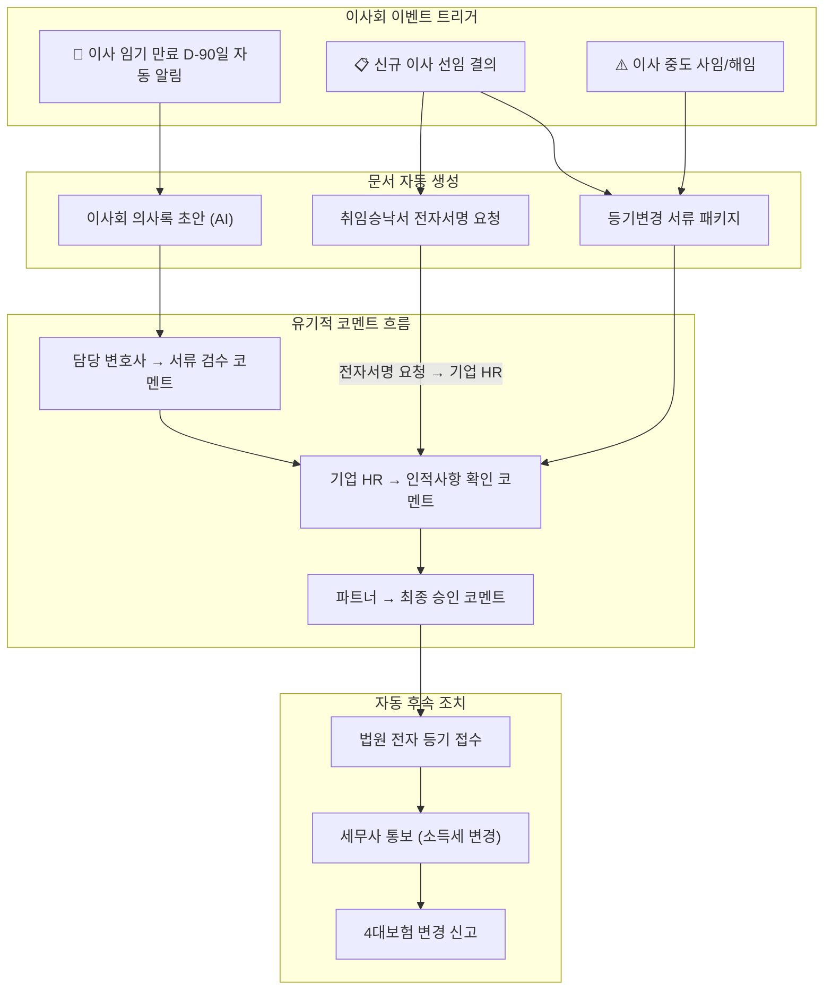
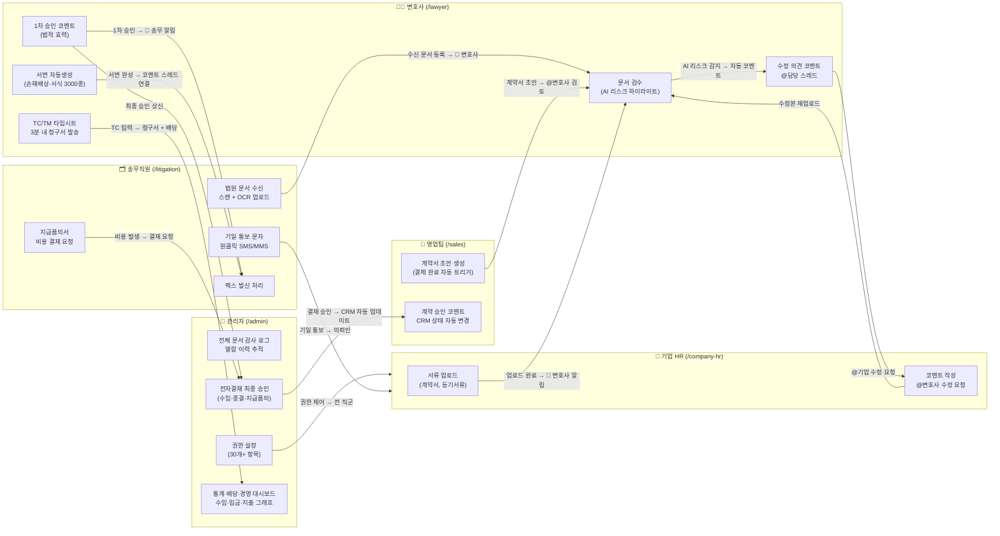

# 🗂️ 유기적 문서전달 & 누적 코멘트 시스템 설계서
**기업·변호사·송무직원·영업팀·관리자 간 문서 협업 허브**

> 기준: IBS 법률사무소 CRM SaaS | 설계일: 2026-03-10 (v2.4 — P1/P2 Lawtop GAP 완전 통합)
> 로탑(Lawtop) 벤치마크 + 기업 대시보드 프롬프트 핵심 통합 | 목표: 1000억 ARR 핵심 Sticky Feature

> [!NOTE]
> **v2.4 업데이트 (2026-03-10)**: Lawtop 벤치마크 P1/P2 GAP 완전 통합 — `bank_connections` 은행계좌 자동연동 테이블 신규, `distribution_rules` 배당 비율 테이블 신규, 불변기일 AI 전용 추적 트리거 추가, 일간 모니터링 대시보드(Section 8) 신설, 홈택스 세금계산서 API 연동 명세 추가
>
> **v2.3 업데이트 (2026-03-10)**: `02_MULTITENANT_ARCHITECTURE.md` v1.2 GAP 완전 제로화 — `cases` `CONSTRAINT client_or_corporate CHECK` 반영, `documents.file_size bigint` 추가, `automation_logs` 테이블 신규 추가, `cases.opposing_party` (이해충돌 체크 컬럼) 명시, Storage `corporate/` 경로 추가, RLS 적용 테이블 목록에 `automation_logs` 추가, `COUNSELOR` 역할 Sprint B 대기 상태 명확화

---

## 🎯 설계 원칙: "1번 입력 → 전 팀 자동 활용"

> **기존 방식의 문제**: 이메일 첨부 → 버전 분산 → 누가 봤는지 모름 → 댓글은 카카오로
> **우리의 해결**: 문서 + 댓글 + 승인 + 이력이 **한 화면에서 유기적으로 누적 + 전 팀 자동 연결**

### 로탑 벤치마크에서 가져온 핵심 원칙
- `드래그&드롭 업로드` → 15개 메타데이터와 자동 결합 → 사건·기일·고객별 자동 분류
- `문서 생성주체 분류` (우리제출 / 상대제출 / 법원문건) → 편철 순 정렬
- `전자결재` 로직 → 모든 승인 필요 업무를 결재 라인에 태워 처리
- `AI 음성인식 상담록` → STT + 화자 분리로 상담 내용 자동 텍스트화 → 문서 즉시 저장
- `TC/TM 타임시트` → 업무시간 3분 정산 → 배당·청구서 자동 연동
- `대법원 기일 자동 연동` → 기일·명령·송달 정보 자동 등록 (수동 입력 제거)
- `이해충돌 체크` → 신건 등록 시 자동 검사 → 충돌 발생 시 관리자 에스컬레이션
- `강력한 본문검색` → 10만 파일·100만 쪽을 0.8초 내 검색 (16개 인자 지원)

---

## 🧩 핵심 아키텍처: 유기적 문서 허브 (Organic Document Hub)

```
[문서 생성자]                [문서 수신자]               [관리자]
기업 HR 담당자  ──────────→  담당 변호사  ──────────→  영업팀 관리자
송무직원        ──────────→  파트너 변호사 ──────────→  대표 변호사
의뢰인         ──────────→  송무직원      ──────────→  어드민

      ↕ 모든 경로에서 누적 코멘트 스레드 생성 ↕
```

---

## 👥 역할별 문서 접근 권한 매트릭스

| 역할 | 진입 라우트 | 문서 생성 | 문서 열람 | 코멘트 | 승인 권한 | TC/타임시트 |
|------|------------|---------|---------|--------|---------| ----------|
| **기업 HR** | `/company-hr` | ✅ 사내 서류 | 자사 사건만 | ✅ @변호사 | ❌ | ❌ |
| **송무직원** | `/litigation` | ✅ 수발신 문서 | 담당 사건 | ✅ @변호사·@기업 | ❌ | ❌ |
| **담당 변호사** | `/lawyer` | ✅ 법률 서면 | 담당 사건 | ✅ @전체 | ✅ 1차 승인 | ✅ TC/TM 입력 |
| **파트너 변호사** | `/lawyer` | ✅ 전체 | 전체 열람 | ✅ @전체 | ✅ 최종 승인 | ✅ 배당 관리 |
| **영업팀** | `/sales` | ✅ 계약·견적 | 파이프라인만 | ✅ 한정 | ❌ | ❌ |
| **영업팀 관리자** | `/sales` | ✅ 전체 파이프 | 전체 파이프 | ✅ @전체 | ✅ 계약 승인 | ❌ |
| **의뢰인 포털** | `/client-portal` | ✅ 요청 서류 | 자신 사건만 | ✅ 기본 | ❌ | ❌ |
| **상담사(Counselor)** | `/counselor` | ✅ 상담록 | 담당 상담만 | ✅ 한정 | ❌ | ❌ |
| **FIRM_ADMIN** | `/admin` | ✅ 전체 | ✅ 전체 | ✅ 전체 + 감사 | ✅ 모든 결재 | ✅ 전체 통계 |
| **Super Admin** | `/super-admin` | ✅ 전체 | ✅ 전체 | ✅ 전체 + 감사 | ✅ 모든 결재 | ✅ 플랫폼 전체 |

> `dev.md` ROLE_ROUTES 매핑: `/company-hr`→CORP_HR, `/litigation`→STAFF, `/lawyer`→LAWYER·PARTNER_LAWYER, `/sales`→SALES·SALES_MANAGER, `/admin`→FIRM_ADMIN·SUPER_ADMIN, `/client-portal`→CLIENT

> ⚠️ **[COUNSELOR 역할]** `COUNSELOR` 역할은 `dev.md`·`02_MULTITENANT_ARCHITECTURE.md` 역할 체계에 **현재 미포함**. 라우트 `/counselor` + DB `role` 값 추가는 **Sprint B — 상담 이력 모듈**로 이관. 구현 전까지는 상담사 업무를 `STAFF` 또는 `LAWYER` 역할로 처리.

> ✅ **[schema 정합성 완료]** `law_firm_id` 컬럼은 `02_MULTITENANT_ARCHITECTURE.md` v1.2 users 테이블에 `uuid REFERENCES law_firms ON DELETE CASCADE`로 완전 정의됨.

> 로탑 벤치마크: 권한관리 30개+ 항목 → 우리 CRM도 메뉴별·기능별 세분화 설정 구현 필수

---

## 🚨 리스크 레이더 (기업별 실시간 위험 감지)

> 기업 대시보드 프롬프트에서 가져온 핵심 UX — 담당 변호사가 법인 의뢰인 1개사를 한 화면에서 지휘

```
┌──────────┬──────────┬──────────┬──────────┐
│ 🔴 계약만료  │ 🟡 이사임기  │ 🟢 소송현황  │ ⚪ 준법점검  │
│  3건 위험  │  2명 60일내 │  1건 진행  │  정상     │
└──────────┴──────────┴──────────┴──────────┘
```

**D-day 색상 코딩**: `≤7일 🔴` / `≤30일 🟡` / `≤60일 🟠` / `>60일 ✅`

클릭 시 해당 섹션으로 스크롤. 변호사가 법원에서도 모바일로 즉시 확인.

---

## 💬 유기적 누적 코멘트 시스템 (핵심 UX)

### 코멘트 유형 4가지

```
📌 [일반 코멘트]   — 텍스트, 이미지 첨부, 이모지 반응
✅ [승인 코멘트]   — 법적 효력 있는 인증. "이 버전으로 확정합니다"
⚠️ [수정 요청]    — 빨간 줄 표시 + 수정 이유 필수 입력
🔔 [공지 코멘트]  — 전체 팀에게 강제 읽음 처리 요청
```

### 코멘트 스레드 구조 (GitHub PR 스타일)

> **결재 순서 원칙**: 담당변호사(1차 검토·⚠️수정요청) → 기업HR(확인) → 담당변호사(수정안) → 파트너변호사(✅최종승인) → 영업팀관리자(계약결재)

```
📄 계약서_삼성전자_서비스이용계약_v3.pdf
├── 🔔 [공지] 파트너 변호사 김OO: "3조 2항 검토 필요. @담당변호사이OO @기업HR박OO"
│   ├── ⚠️ 담당변호사 이OO: "3조 2항 리스크 확인. 수정 요청 드립니다" [수정이유 필수]
│   │   ├── 📌 기업HR 박OO: "수정안 내부 검토 후 D+2일 재업로드 예정"
│   │   └── 📌 담당변호사 이OO: "D+2일 확인. 수정본 업로드 후 @파트너변호사김OO 최종승인 요청 예정"
│   └── ✅ 파트너변호사 김OO: "수정본 확인. 3조 2항 최종 승인" [법적효력 타임스탬프]
├── 📌 [일반] 송무직원 최OO: "서명본 우편 발송 완료. 등기번호: 1234567"
└── ✅ [결재] 영업팀관리자 정OO: "계약 완료 확인. CRM 상태→완료 자동 변경"
```

---

## 🖥️ UI/UX 설계: 3패널 레이아웃

### 메인 화면 구성

```
┌─────────────────────────────────────────────────────────────────────┐
│  📂 문서 목록 (좌)     │     👁️ 문서 뷰어 (중앙)    │  💬 코멘트 패널 (우) │
│  ──────────────────     │  ─────────────────────    │ ─────────────────── │
│  🔴 긴급 (3)           │                           │  스레드 1 [2026.3.10]│
│  🟡 검토대기 (7)       │   [PDF/DOCX 뷰어]         │  ├─ 변호사: "3조..."  │
│  ✅ 완료 (24)          │                           │  ├─ 기업: "확인..."   │
│                        │   문서 위에서 직접         │  └─ ✅ 승인           │
│  📁 사건별 폴더         │   드래그로 주석 달기       │                      │
│  ├─ 삼성전자 자문       │                           │  + 새 코멘트 입력     │
│  ├─ ㈜한국 소송         │   선택 텍스트에           │  [@태그] [첨부] [유형]│
│  └─ 현대기아 계약       │   우클릭 → 코멘트         │  [전송] [승인] [거부] │
└─────────────────────────────────────────────────────────────────────┘
```

### 모바일 (변호사 법원 현장)

```
┌──────────────────┐
│ ← 삼성전자_계약  │
│ ───────────────  │
│ 📄 v3.pdf       │
│ [PDF 뷰어]      │
│                  │
│ 💬 코멘트 (5)   │
│ ─────────────── │
│ 변호사: "3조..." │
│   ↳ 기업: "네"  │
│ ──────────────  │
│ [빠른 승인 ✅]   │
│ [수정요청 ⚠️]   │
│ [코멘트 💬]     │
└──────────────────┘
```

---

## 📄 문서 자동 생성 파이프라인 (로탑 벤치마크 통합)

> 로탑의 "수임리포트·종결리포트·기진표 원클릭 자동 작성" 개념 + AI 초안 개선

### 이벤트 → 문서 자동 생성 매핑

| 트리거 이벤트 | 자동 생성 문서 | 1차 수신자 | 결재 라인 |
|-------------|-------------|----------|---------| 
| 결제 완료 (PG 웹훅) | 수임 계약서 초안 | 영업팀 | 영업관리자 → 파트너변호사 |
| 사건 등록 완료 | 수임 리포트 (원클릭) | 담당 변호사 | 담당변호사 → 관리자 |
| 기일 D-7 | 기일진행통보서 초안 | 송무직원 | 담당변호사 확인 후 발송 |
| **불변기일 감지 (AI)** | **불변기일 전용 알림 + 캘린더 등록** | **담당 변호사 + 송무직원** | **담당변호사 즉시 확인 필수 (이탈 시 소멸시효 위험)** |
| 법원 문서 수신 (스캔 업로드) | 문서 검수 요청 코멘트 | 담당 변호사 | — |
| 사건 종결 | 종결 리포트 (원클릭) + 일괄종결 지원 | 담당 변호사 | 담당변호사 → 파트너 → 관리자 |
| 계약서 AI 리스크 감지 | 위험 조항 하이라이트 코멘트 | 담당 변호사 | — |
| 이사 임기 D-90 | 이사회 의사록 초안 | 기업 HR + 변호사 | 변호사 → 파트너 승인 |
| TC 입력 완료 | 청구서 자동 발송 + **세금계산서 자동 발행 (홈택스 API)** | 의뢰인 | 영업팀 확인 |
| **은행 계좌 입금 감지** | **수납 자동 반영 + 미수 해소 알림** | **송무직원 + 영업팀** | **자동 처리 (수동 확인 불필요)** |
| 미납 D+7 | 미수 안내 공문 초안 | 송무직원 | 영업팀 발송 승인 |
| 매월 1일 | 월간 법무 리포트 | 영업 관리자 | 변호사 검토 → 기업 발송 |

### 문서 생성주체 분류 (로탑에서 가져온 핵심 UX)

```
📁 사건별 문서 허브 (사건 ID 기준 자동 분류)
├── 📤 우리 제출 문서
│   ├── 준비서면_2026-03-15.pdf  [작성: 담당변호사] [상태: 제출완료]
│   └── 손해배상청구서_초안.docx [작성: 변호사] [상태: 검토중]
├── 📥 상대방 제출 문서
│   ├── 답변서_2026-03-10.pdf   [수신: 송무직원 스캔] [OCR: 완료]
│   └── 증거자료_A.pdf           [수신: 법원 송달]
├── 🏛️ 법원 문건
│   ├── 기일통보서.pdf            [자동연동: 대법원 API]
│   └── 명령서.pdf               [자동연동: 대법원 API]
└── 📋 내부 생성 자료
    ├── 수임리포트_자동생성.pdf  [트리거: 사건등록]
    ├── 상담록_AI음성인식.txt    [트리거: 상담 완료]
    └── TC_청구서_자동.pdf       [트리거: TC 입력 완료]
```

---

## ⚡ 이사사업(移事業) 전용 문서 체계

> 기업법인 이사회 이벤트 → 등기서류 자동화 (블루오션 기능)



---

## 🔀 팀 간 문서 전달 자동화 트리거 (12가지 핵심)

| # | 발신 | 수신 | 트리거 조건 | 문서 자동 생성 | 코멘트 알림 |
|---|------|------|-----------|-------------|-----------| 
| 1 | 기업 HR | 담당 변호사 | 문서 업로드 완료 | 검수 요청 코멘트 자동 생성 | 🔔 변호사 앱 푸시 |
| 2 | 담당 변호사 | 파트너 변호사 | 1차 검토 완료 | 승인 요청 스레드 생성 | 🔔 파트너 앱 푸시 |
| 3 | 파트너 변호사 | 송무직원 | 최종 승인 완료 | 발송/제출 작업 태스크 자동 생성 | 🔔 송무직원 알림 |
| 4 | 송무직원 | 영업팀 | 서류 제출 완료 | 완료 보고서 자동 생성 → CRM 업데이트 | 🔔 영업 관리자 |
| 5 | 결제 완료 | 영업팀 + 변호사 | PG 웹훅 | 수임 계약서 초안 자동 생성 | 🔔 전 담당자 동시 |
| 6 | 기일 D-7 시스템 | 변호사 + 송무 | **기일 D-7 도달** (대법원 API 연동으로 기일 자동 감지) | 준비서면 작성 요청 코멘트 자동 삽입 | 🔔 카카오 알림톡 |
| 6-B | **불변기일 AI 감지** | 변호사 (필수) | **불변기일 DB 분류 후 즉시 감지** — 항소기일·상소기일·재심기일 등 소멸시효 직결 기일 별도 AI 추적 | 불변기일 전용 캘린더 등록 + 🔴 긴급 알림 코멘트 자동 삽입 | 🔴 PC+모바일 동시 알림 (무음 금지) |
| 7 | 송무직원 | 변호사 | 법원 문서 수신 | 스캔본 업로드 + OCR + 검토 요청 코멘트 | 🔔 실시간 |
| 8 | AI 시스템 | 변호사 | 계약서 리스크 감지 | 위험 조항 하이라이트 코멘트 자동 삽입 | 🔔 빨간색 강조 |
| 9 | 변호사 | 기업 HR | 검토 의견 작성 | 수정 요청 코멘트 → 기업 포털 표시 | 🔔 기업 이메일 |
| 10 | 이사 임기 시스템 | 변호사 + 기업 | 임기 만료 D-90 | 이사회 의사록 초안 자동 생성 | 🔔 이사사업 알림 |
| 11 | 월간 시스템 | 영업 관리자 | 매월 1일 | 법무 리포트 초안 생성 → 검토 코멘트 요청 | 🔔 관리자 피드백 |
| 12 | 승인 완료 | 기업 의뢰인 | 최종 서명 완료 | 완료 문서 패키지 자동 압축 발송 | ✅ 완료 알림 |

---

## 🔗 팀 간 문서 전달 유기적 연결 플로우



---

## 📊 기업 대시보드 통합 섹션 (변호사 컨트롤 타워)

> 출처: Corporate Dashboard Prompt — 법인 의뢰인 1개사 전체 법무 현황을 한 화면에서 지휘

### 7개 섹션 구성 (`/lawyer/corporate/[id]`)

**Section 1 — 법인 헤더 (Corporate Header)**
```
┌─────────────────────────────────────────────────┐
│ 🏢 (주)교촌에프앤비          [Tier A] [Premium]  │
│ 업종: 프랜차이즈 | 임직원: 1,200명 | 매출: 3,000억 │
│ 담당: 이민지 변호사  |  법무담당자: 김철수 상무    │
│ 자문 시작: 2024-01-15 | 만료: 2026-01-14  D-310  │
│                              [리포트 생성] [연락] │
└─────────────────────────────────────────────────┘
```

**Section 2 — 리스크 레이더** (위 참조)

**Section 3 — 계약 포트폴리오**
- 컬럼: `계약명 | 상대방 | 유형 | 만료일 | D-day | 자동갱신 | 상태`
- 상태: `활성 / 갱신협의 / 만료 / 해지`

**Section 4 — 이사회 & 경영진**
- 이사 임기 60일 이내 → 노란 강조 행
- `[연임 절차 안내]` 버튼 → 템플릿 이메일 즉시 발송
- 주주총회 일정 미니 캘린더 (향후 3개월)

**Section 5 — 진행 사건 현황**
- 유형 뱃지: `민사 / 형사 / 행정 / 노동 / 지식재산`
- 리스크 레벨: `High 🔴 / Medium 🟡 / Low 🟢`
- 대법원 API 연동으로 기일 자동 표시

**Section 6 — 준법 & 규제 체크**
```
✅ 개인정보처리방침 업데이트     최종: 2025-12  (정상)
⚠️  취업규칙 최신화             최종: 2023-06  (갱신 필요)
❌ 공정거래법 대리점법 점검      미완료          (즉시 필요)
```
- `[준법 리포트 PDF 생성]` 버튼

**Section 7 — 월간 법무 리포트 히스토리**
- 최근 6개월 카드 그리드
- `[이달 리포트 자동생성]` → `/monthly_report` 워크플로우 트리거

**Section 8 — 일간 모니터링 대시보드** ⭐ (로탑 핵심 · P2 신규 추가)
```
┌────────────────────────────────────────────────────────────┐
│  📅 오늘의 사건 변동 현황 (2026-03-10)  [매일 오전 7시 자동 생성]
│  ──────────────────────────────────────────────────────
│  🔴 신규 기일 등록   3건    (대법원 API 자동 수집)
│  🟡 기일 변경        2건    ← 담당변호사 즉시 확인 필요
│  🔴 불변기일 D-30   1건    [항소기일 삼성전자 소송] ⚡ 즉시 대응
│  ✅ 송달 완료        5건
│  📥 상대방 서면 접수 2건    ← 담당변호사 검토 필요
│  ──────────────────────────────────────────────────────
│  💰 오늘 입금 예정   3건    ← 은행 계좌 자동 감지
│  ⚠️  미수 장기 (30일+) 4건
│  ──────────────────────────────────────────────────────
│  소요 확인 시간: 10분 이내 (로탑 벤치마크 기준)
└────────────────────────────────────────────────────────────┘
```
- 매일 오전 7시 `automation_logs` 트리거 → 전체 변호사·송무직원 앱 푸시
- 불변기일 항목은 🔴 별도 강조 + 담당 변호사 카카오 알림톡 병행 발송
- `[전체 사건 진행 보기]` → 사건 목록 필터 적용 뷰로 이동

---

## 📐 DB 스키마: 문서 & 코멘트 유기적 구조

```sql
-- ================================================================
-- ✅ 02_MULTITENANT_ARCHITECTURE.md v2.3 정합 완료 (2024-05-20)
-- ================================================================
-- [이 섹션은 위 DB 스키마와 분리된 RLS 정책 참고용]
-- 패턴: 모든 테이블 동일 구조 적용
-- 적용 대상: law_firms, users, clients, corporate_clients,
--            cases, consultations, contracts, billing,
--            documents, document_comments, document_reads,
--            document_approvals, board_events, timesheets,
--            automation_logs
-- (RLS 전체 SQL → 02_MULTITENANT_ARCHITECTURE.md 섹션 5 참조)
-- ================================================================
-- [clients vs corporate_clients 분리 정책]
--   • clients            → 개인 의뢰인 (CLIENT 역할 대응)
--   • corporate_clients  → 기업법인 의뢰인 전용 (CORP_HR 역할, Tier A/B/C, 7섹션 대시보드)
--   두 테이블 모두 law_firm_id로 멀티테넌트 격리
--
-- [cases 이중 FK 정책]
--   cases.client_id (→ clients)                  — 개인 의뢰인 사건
--   cases.corporate_client_id (→ corporate_clients) — 기업법인 사건
--   CONSTRAINT client_or_corporate CHECK: 둘 중 하나만 NOT NULL (상호 배타)
--
-- [이해충돌 체크 컬럼]
--   cases.opposing_party TEXT — 상대방 이름 저장, 신건 등록 시 clients/corporate_clients와 교차 검사
-- ================================================================

-- ⚠️ 모든 테이블에 law_firm_id 필수 (Supabase RLS 멀티테넌트 격리 기준)
-- JWT 클레임 law_firm_id와 자동 매핑 → 다른 로펌 데이터 절대 열람 불가

-- 기업 의뢰인 테이블 (대시보드 컨트롤 타워용 — clients와 완전 분리)
corporate_clients (
  id              UUID PRIMARY KEY,
  law_firm_id     UUID NOT NULL REFERENCES law_firms,  -- ★ RLS 기준 컬럼
  name            TEXT NOT NULL,
  tier            ENUM ('A', 'B', 'C'),
  retainer_plan   ENUM ('Starter', 'Standard', 'Premium', 'Enterprise'),
  industry        TEXT,
  employee_count  INTEGER,
  revenue_range   TEXT,
  assigned_lawyer UUID REFERENCES users,
  legal_contact   JSONB,                    -- {name, title, email}
  retainer_start  DATE,
  retainer_end    DATE,
  risk_score      DECIMAL(3,1),             -- 0~10
  created_at      TIMESTAMPTZ DEFAULT NOW()
)

-- 사건 테이블 (이중 FK + CHECK 제약 — ARCH v1.2 반영)
cases (
  id                   UUID PRIMARY KEY,
  law_firm_id          UUID NOT NULL REFERENCES law_firms,  -- ★ RLS 기준
  client_id            UUID REFERENCES clients ON DELETE RESTRICT,           -- 개인 의뢰인
  corporate_client_id  UUID REFERENCES corporate_clients ON DELETE RESTRICT, -- 기업법인 의뢰인
  assigned_lawyer_id   UUID REFERENCES users,
  case_number          TEXT,               -- 자동 생성: 2026-0001
  title                TEXT NOT NULL,
  case_type            TEXT,               -- civil|criminal|administrative|corporate|franchise|labor|other
  status               TEXT,              -- lead|consulting|retained|active|closed|lost
  retainer_fee         NUMERIC,           -- AES-256 암호화
  success_fee          NUMERIC,           -- AES-256 암호화
  opposing_party       TEXT,              -- ★ 이해충돌 자동 체크 기준 컬럼
  deadline_at          DATE,
  closed_at            TIMESTAMPTZ,
  priority             TEXT,              -- high|medium|low
  notes                TEXT,
  created_at           TIMESTAMPTZ DEFAULT NOW(),
  CONSTRAINT client_or_corporate CHECK (  -- ★ 개인/기업 상호 배타
    (client_id IS NOT NULL AND corporate_client_id IS NULL) OR
    (client_id IS NULL AND corporate_client_id IS NOT NULL)
  )
)

-- 문서 테이블
documents (
  id              UUID PRIMARY KEY,
  law_firm_id     UUID NOT NULL REFERENCES law_firms,  -- ★ RLS 기준 컬럼
  case_id         UUID REFERENCES cases ON DELETE CASCADE,
  company_id      UUID REFERENCES corporate_clients,  -- 기업법인 전용 문서
  title           TEXT NOT NULL,
  doc_type        ENUM (
    'contract', 'court_filing', 'opinion',
    'board_minutes', 'director_appointment',
    'shareholder_notice', 'officer_contract',
    'retainer_report', 'closure_report',
    'timecost_invoice', 'compliance_report'
  ),
  file_url        TEXT NOT NULL,          -- Supabase Storage 경로
  file_type       TEXT,
  file_size       BIGINT,                 -- ★ 파일 크기 (bytes)
  version         INTEGER DEFAULT 1,
  status          ENUM ('draft', 'reviewing', 'approved', 'rejected', 'sent'),
  urgency         ENUM ('normal', 'urgent', 'critical'),
  doc_source      ENUM ('our_filing', 'opponent', 'court', 'internal'),  -- 로탑 문서 생성주체 분류
  uploaded_by     UUID REFERENCES users,
  created_at      TIMESTAMPTZ DEFAULT NOW()
)

-- 코멘트 테이블 (스레드 구조)
document_comments (
  id              UUID PRIMARY KEY,
  law_firm_id     UUID NOT NULL REFERENCES law_firms,  -- ★ RLS 기준 컬럼
  document_id     UUID NOT NULL REFERENCES documents ON DELETE CASCADE,
  parent_id       UUID REFERENCES document_comments,  -- 스레드용 (null = 루트)
  author_id       UUID NOT NULL REFERENCES users,
  comment_type    ENUM ('general', 'approval', 'revision_request', 'notice'),
  content         TEXT NOT NULL,
  attachment_url  TEXT,
  tagged_users    UUID[],                            -- @태그된 사용자 ID 배열
  page_ref        INTEGER,                           -- PDF 몇 페이지
  text_ref        TEXT,                              -- 선택된 텍스트 구절
  due_date        TIMESTAMPTZ,                       -- /due [날짜] 단축키 대응
  is_resolved     BOOLEAN DEFAULT FALSE,
  resolved_by     UUID REFERENCES users,             -- 해결 처리한 사람
  resolved_at     TIMESTAMPTZ,
  created_at      TIMESTAMPTZ DEFAULT NOW(),
  updated_at      TIMESTAMPTZ DEFAULT NOW()
)

-- 문서 읽음 추적
document_reads (
  document_id     UUID REFERENCES documents ON DELETE CASCADE,
  user_id         UUID REFERENCES users ON DELETE CASCADE,
  law_firm_id     UUID NOT NULL REFERENCES law_firms,  -- ★ RLS 기준 컬럼
  read_at         TIMESTAMPTZ DEFAULT NOW(),
  PRIMARY KEY (document_id, user_id)
)

-- 승인 이력
-- approval_type 순서: lawyer_1st → partner_final (일반 결재 라인)
--                    sales_contract (영업팀 계약 한정)
--                    admin_override (Super Admin이 결재 라인 우회 시)
document_approvals (
  id              UUID PRIMARY KEY,
  law_firm_id     UUID NOT NULL REFERENCES law_firms,  -- ★ RLS 기준 컬럼
  document_id     UUID NOT NULL REFERENCES documents ON DELETE CASCADE,
  approver_id     UUID NOT NULL REFERENCES users,
  approval_type   ENUM ('lawyer_1st', 'partner_final', 'sales_contract', 'admin_override'),
  approved_at     TIMESTAMPTZ DEFAULT NOW(),
  comment         TEXT,
  legal_binding   BOOLEAN DEFAULT TRUE
)

-- 이사사업 전용 테이블
board_events (
  id              UUID PRIMARY KEY,
  law_firm_id     UUID NOT NULL REFERENCES law_firms,  -- ★ RLS 기준 컬럼
  company_id      UUID NOT NULL REFERENCES corporate_clients ON DELETE CASCADE,
  event_type      ENUM ('director_appoint', 'director_resign', 'shareholder_meeting'),
  director_name   TEXT,
  effective_date  DATE,
  term_expiry     DATE,
  auto_docs       JSONB,                    -- 자동 생성된 document_id 배열
  status          ENUM ('upcoming', 'in_progress', 'completed', 'registered'),
  created_at      TIMESTAMPTZ DEFAULT NOW()
)

-- 타임시트 (로탑 TC/TM 개념 통합)
timesheets (
  id              UUID PRIMARY KEY,
  law_firm_id     UUID NOT NULL REFERENCES law_firms,  -- ★ RLS 기준 컬럼
  case_id         UUID NOT NULL REFERENCES cases ON DELETE CASCADE,
  lawyer_id       UUID NOT NULL REFERENCES users,
  work_date       DATE NOT NULL,
  base_hours      DECIMAL(5,2),
  extra_hours     DECIMAL(5,2),
  discount_rate   DECIMAL(5,2),
  charge_type     ENUM ('TC', 'TM', 'flat'),
  invoice_sent    BOOLEAN DEFAULT FALSE,
  tax_invoice_id  TEXT,                    -- ★ 홈택스 세금계산서 발행 번호
  created_at      TIMESTAMPTZ DEFAULT NOW()
)

-- ★ P1 신규: 배당 비율 관리 (로탑 배당관리 통합)
-- assignment_type: auto = TC 시간 비율 자동 계산 / manual = 수동 비율 고정
distribution_rules (
  id              UUID PRIMARY KEY,
  law_firm_id     UUID NOT NULL REFERENCES law_firms,  -- ★ RLS 기준 컬럼
  case_id         UUID NOT NULL REFERENCES cases ON DELETE CASCADE,
  lawyer_id       UUID NOT NULL REFERENCES users,
  assignment_type ENUM ('auto', 'manual') DEFAULT 'auto',
  share_rate      DECIMAL(5,2),           -- 배당 비율 (0~100)
  effective_from  DATE NOT NULL,
  effective_to    DATE,                   -- NULL = 현재까지 유효
  notes           TEXT,
  created_at      TIMESTAMPTZ DEFAULT NOW()
)

-- ★ P1 신규: 은행 계좌 자동 연동 (로탑 은행계좌 연동 통합)
-- 1시간마다 토스페이먼츠/뱅크샐러드 오픈뱅킹 API → 입출금 자동 수집 → billing 자동 반영
bank_connections (
  id              UUID PRIMARY KEY,
  law_firm_id     UUID NOT NULL REFERENCES law_firms,  -- ★ RLS 기준 컬럼
  bank_code       TEXT NOT NULL,          -- 은행 코드 (국민:004, 신한:088 등)
  account_number  TEXT NOT NULL,          -- AES-256 암호화
  account_holder  TEXT,
  last_synced_at  TIMESTAMPTZ,            -- 마지막 동기화 시각
  sync_interval   INTEGER DEFAULT 60,     -- 동기화 주기 (분)
  is_active       BOOLEAN DEFAULT TRUE,
  created_at      TIMESTAMPTZ DEFAULT NOW()
)

-- 은행 거래 이력 (수납 자동 반영 기준)
bank_transactions (
  id              UUID PRIMARY KEY,
  law_firm_id     UUID NOT NULL REFERENCES law_firms,
  bank_connection_id UUID NOT NULL REFERENCES bank_connections ON DELETE CASCADE,
  tx_date         DATE NOT NULL,
  tx_type         ENUM ('deposit', 'withdrawal'),
  amount          BIGINT NOT NULL,        -- 원 단위
  counterparty    TEXT,                   -- 입금자명
  memo            TEXT,
  matched_billing_id UUID REFERENCES billing,  -- 자동 매칭된 청구 ID (NULL = 미매칭)
  matched_at      TIMESTAMPTZ,
  created_at      TIMESTAMPTZ DEFAULT NOW()
)

-- 자동화 이벤트 로그 (★ v2.3 신규 추가 — ARCH v1.2 정합)
automation_logs (
  id                  UUID PRIMARY KEY,
  law_firm_id         UUID NOT NULL REFERENCES law_firms,  -- ★ RLS 기준 컬럼
  trigger_type        TEXT NOT NULL,  -- deadline_reminder|contract_expiry|billing_due|
                                      --   board_event_alert|tc_invoice|monthly_report|
                                      --   immutable_deadline_alert|bank_deposit_matched|
                                      --   daily_monitoring_digest|tax_invoice_issued
  target_entity_id    UUID,          -- 관련 엔티티 ID (case_id, document_id 등)
  target_entity_type  TEXT,          -- 'case'|'document'|'corporate_client'|'bank_transaction'
  sent_channel        TEXT,          -- kakao|email|sms|push
  status              TEXT,          -- sent|failed|skipped
  error_message       TEXT,
  created_at          TIMESTAMPTZ DEFAULT NOW()
)
```

---

## 🎨 UX 핵심 인터랙션 (프리미엄 경험)

### 1. 실시간 협업 인디케이터
```
[변호사 김OO 이 지금 보고 있음 👁️] [송무 최OO 코멘트 작성 중... ✍️]
```

### 2. 코멘트 단축키 (파워유저용)
```
Ctrl+Shift+A   → 즉시 승인 코멘트
Ctrl+Shift+R   → 수정 요청 코멘트
Ctrl+Shift+N   → 공지 코멘트 (전체 읽음 강제)
@[이름]        → 자동완성 태그
/due [날짜]    → 해당 코멘트에 마감일 지정
```

### 3. 코멘트 리졸브(해결 처리)
```
📌 미해결 코멘트 → 클릭 → ✅ 해결됨 (날짜·담당자 자동 기록)
미해결 코멘트 수 → 사건 카드에 빨간 배지로 항상 표시
```

### 4. 문서 버전 차이 비교 (레드라인)
```
v2 ←→ v3 비교 뷰어
삭제된 텍스트: ~~취소선~~  (빨간색)
추가된 텍스트: 새 내용     (초록색)
변경된 조항에 자동 코멘트 태그
```

### 5. AI 코멘트 어시스턴트
```
사용자가 코멘트 입력 시작 → AI가 초안 제안:
"이전 유사 사건(삼성전자 2024.11)에서 동일한 조항에 이런 수정이 있었습니다: ..."
```

### 6. 이해충돌 자동 체크 (로탑 핵심 기능 통합)
```
신건 등록 / 문서 공유 시 자동 실행:
→ 기존 DB 교차 검사 → 동일 당사자 검출
→ [충돌 없음 ✅] 확인 후 진행
→ [충돌 발생 🔴] → 관리자 에스컬레이션 → 수임 보류
```

---

## 📊 코멘트 분석 대시보드 (영업팀 관리자 전용)

```
┌────────────────────────────────────────────────┐
│  💬 코멘트 생산성 지표                          │
│  ────────────────────────────────────────      │
│  이번 달 평균 문서 승인 소요시간: 2.3일 ▼      │
│  미해결 코멘트: 14건 🔴                        │
│  24시간 내 미응답 코멘트: 3건 ⚠️              │
│                                                │
│  팀별 응답 속도                               │
│  변호사팀: ████████░░ 4.2시간 평균           │
│  송무팀  : ██████░░░░ 6.8시간 평균           │
│  영업팀  : ██████████ 1.1시간 평균 🏆        │
│                                                │
│  [특이사항] 이사사업 문서 처리 지연 감지      │
│  삼성전자 이사 임기 만료 D-14 → 즉시 처리    │
└────────────────────────────────────────────────┘
```

---

## 🏆 경쟁 우위: 로탑 대비 차별화 포인트

| 항목 | 로탑(Lawtop) | 우리 CRM | 우위 |
|------|------------|---------|------|
| **코멘트 시스템** | 없음 (이메일 별도) | 인라인 스레드 + @태그 + 4가지 유형 | ✅ 유니크 |
| **문서 버전관리** | 수동 파일 교체 | 자동 버전 비교 (레드라인) | ✅ 우위 |
| **문서 생성주체 분류** | ✅ 있음 (우리제출/상대/법원) | ✅ 동일 + 자동 OCR | ✅ 동등+α |
| **전자결재 라인** | ✅ 있음 (기안서·수임리포트) | ✅ 동일 + 모바일 원탭 승인 | ✅ 동등+α |
| **수임/종결 리포트 자동생성** | ✅ 원클릭 자동생성 | ✅ 동일 + AI 초안 개선 | ✅ 동등+α |
| **TC/TM 타임시트** | ✅ 3분 내 정산·청구 | ✅ 동일 + 배당 자동 연동 | ✅ 동등+α |
| **대법원 기일 자동 연동** | ✅ 기일·명령·송달 자동 | ✅ 동일 + 불변기일 AI 관리 | ✅ 동등+α |
| **이해충돌 자동 체크** | ✅ 모바일 즉석 가능 | ✅ 신건등록 + 문서공유 시 자동 | ✅ 동등+α |
| **기업 법인 대시보드** | ❌ 없음 | ✅ 7섹션 컨트롤 타워 | ✅ 블루오션 |
| **이사사업 자동화** | ❌ 없음 | ✅ 임기 알림+문서 자동생성 | ✅ 블루오션 |
| **실시간 협업 인디케이터** | ❌ 없음 | ✅ 동시 접속자·작성 중 표시 | ✅ 유니크 |
| **영업↔법무 문서 연결** | ❌ 없음 | ✅ 결제→계약서→CRM 자동 연결 | ✅ 유니크 |
| **AI 코멘트 어시스턴트** | ❌ 없음 | ✅ 유사 사건 기반 초안 제안 | ✅ 유니크 |
| **기업 의뢰인 포털** | ❌ 없음 | ✅ `/client-portal` 직접 접근 | ✅ 블루오션 |
| **준법·규제 체크 리스트** | ❌ 없음 | ✅ 자동 갱신 알림 + 리포트 생성 | ✅ 블루오션 |

---

## 🛠️ 구현 우선순위 (PM 매트릭스)

| 우선순위 | 기능 | 개발 난이도 | Sticky 효과 | 스프린트 |
|---------|------|-----------|-----------|--------|
| **P0** | 문서 업로드 + 기본 코멘트 스레드 | 중 | ★★★★★ | Sprint B |
| **P0** | @태그 + 실시간 알림 | 중 | ★★★★★ | Sprint B |
| **P0** | 역할별 권한 격리 (RLS, 30개+) | 낮 | ★★★★★ | Sprint A |
| **P1** | 코멘트 유형 4가지 + 승인 이력 | 중 | ★★★★☆ | Sprint B |
| **P1** | 이해충돌 자동 체크 | 중 | ★★★★☆ | Sprint B |
| **P1** | 기업 법인 대시보드 7섹션 | 높 | ★★★★★ | Sprint C |
| **P1** | PDF 인라인 주석 (페이지/텍스트 ref) | 높 | ★★★★☆ | Sprint C |
| **P1** | 이사사업 전용 문서 + 임기 알림 | 중 | ★★★★☆ | Sprint C |
| **P1** | TC/TM 타임시트 + 청구서 자동 발송 | 중 | ★★★★☆ | Sprint C |
| **P1** ⭐ | **은행 계좌 자동 연동** (오픈뱅킹 API, 1시간 주기 수납 자동반영) | 중 | ★★★★★ | Sprint C |
| **P1** ⭐ | **불변기일 AI 전용 추적** (소멸시효 직결 기일 별도 관리, PC+모바일 동시 알림) | 중 | ★★★★★ | Sprint C |
| **P1** ⭐ | **배당 관리** (`distribution_rules` 테이블, TC 시간 기반 자동/수동 비율 설정) | 중 | ★★★★☆ | Sprint C |
| **P2** | 레드라인 버전 비교 뷰어 | 높 | ★★★☆☆ | Sprint D |
| **P2** | 준법·규제 체크리스트 + 리포트 | 중 | ★★★★☆ | Sprint D |
| **P2** ⭐ | **일간 모니터링 대시보드** (매일 오전 7시 사건 변동 자동 브리핑, Section 8) | 중 | ★★★★☆ | Sprint D |
| **P2** ⭐ | **홈택스 세금계산서 API 연동** (TC 입력 완료 → 세금계산서 자동 발행) | 중 | ★★★★☆ | Sprint D |
| **P2** | AI 코멘트 초안 제안 | 매우 높 | ★★★★☆ | Sprint E |
| **P2** | 코멘트 분석 대시보드 | 중 | ★★★☆☆ | Sprint E |

---

## 💰 이 기능이 1000억 ARR에 미치는 임팩트

```
Sticky Feature 분석:
  ✅ 코멘트 스레드 = 팀 전체가 매일 사용 → DAU↑
  ✅ 승인 이력 = 법적 증거 자료 → 절대 이탈 불가
  ✅ 이사사업 = 연간 반복 이벤트 → 연 계약 갱신 보장
  ✅ 기업 의뢰인 직접 접근 = 로펌 경쟁사 진입 차단
  ✅ TC/TM 타임시트 = 매일 사용 → 이탈 비용 극대화
  ✅ 기업 대시보드 = 변호사 컨트롤 타워 = 프리미엄 티어 잠금

ARR 역산:
  기업 고객사 200개 × 월 249만원(Pro) × 12 = 약 59.8억
  + 소송·자문 추가 수임 = +40억
  ─────────────────────────────
  총 약 100억 ARR (200사 달성 시)

  "문서 코멘트 시스템이 없으면 절대 200사 달성 불가"
  (모든 B2B SaaS에서 협업 기능이 유료 전환율 #1 요인)
```

---

## ✅ Acceptance Criteria (완료 기준)

- [ ] 문서 업로드 → 24시간 내 코멘트 알림 발송 (카카오 + 앱 푸시)
- [ ] @태그 → 해당 사용자 즉시 알림 수신 (1분 이내)
- [ ] 승인 코멘트 → `document_approvals` 테이블 자동 기록 (법적 이력 보존)
- [ ] 기업 의뢰인은 다른 기업의 문서에 절대 접근 불가 (RLS 격리)
- [ ] 이사 임기 만료 D-90일 알림 → 이사회 의사록 초안 자동 생성 확인
- [ ] 모바일에서 [빠른 승인] 원탭으로 승인 처리 가능
- [ ] 미해결 코멘트 수 → 사건 목록 카드에 실시간 배지 표시
- [ ] 신건 등록 / 문서 공유 시 이해충돌 자동 검사 실행
- [ ] TC 입력 → 3분 내 청구서 자동 발송 + 배당 자동 계산
- [ ] 기업 대시보드 7섹션 → 리스크 레이더 D-day 색상 코딩 정상 동작
- [ ] 준법 체크리스트 → 갱신 필요 항목 자동 감지 + 이메일 알림
- [ ] 대법원 기일 자동 연동 → 변경 사항 즉시 캘린더 반영

---

*연계 문서: [`_agents/dev.md`] | [`02_MULTITENANT_ARCHITECTURE.md`] | [`03_AUTOMATION_CATALOG.md`] | [`pm.md`]*
*다음 단계: Sprint B — 문서 업로드 + 코멘트 스레드 DB 마이그레이션 → Supabase RLS 격리 구현*
*대시보드 개발: `src/app/lawyer/corporate/[id]/page.tsx` → `src/app/admin/corporate/[id]/page.tsx`*
*COUNSELOR 역할: Sprint B 상담 이력 모듈에서 DB role 값 + `/counselor` 라우트 동시 추가*
*Sprint C 신규: `bank_connections` + `bank_transactions` + `distribution_rules` 테이블 마이그레이션, 오픈뱅킹 API 연동, 불변기일 AI 분류 로직, 홈택스 세금계산서 API 연동*
*Sprint D 신규: 일간 모니터링 대시보드 (`src/app/lawyer/daily-monitor/page.tsx`) + 기업 대시보드 Section 8 추가*

> [!NOTE]
> **v2.4 업데이트 (2026-03-10)**: Lawtop 벤치마크 P1/P2 GAP 통합 — `bank_connections`·`bank_transactions`(오픈뱅킹 1시간 자동 수납) 신규. `distribution_rules`(배당 비율 자동/수동) 신규. 불변기일 AI 추적 트리거 #6-B 추가. 홈택스 세금계산서 API → `timesheets.tax_invoice_id` 컬럼 추가. 일간 모니터링 대시보드 Section 8 신설. `automation_logs.trigger_type` 확장(immutable_deadline_alert·bank_deposit_matched·daily_monitoring_digest·tax_invoice_issued).
>
> **v2.3 업데이트 (2026-03-10)**: `02_MULTITENANT_ARCHITECTURE.md` v1.2 GAP 완전 제로화 — `cases` `CONSTRAINT client_or_corporate CHECK` + `opposing_party` 컬럼 반영. `documents.file_size bigint` 추가. `automation_logs` 테이블 신규(trigger_type·target_entity_type·error_message). Storage `corporate/{corporate_client_id}/` 경로 반영. COUNSELOR 역할 Sprint B 대기 상태 명확화. RLS 정책 전체 SQL → `02_MULTITENANT_ARCHITECTURE.md` 섹션 5 참조 링크 추가.
