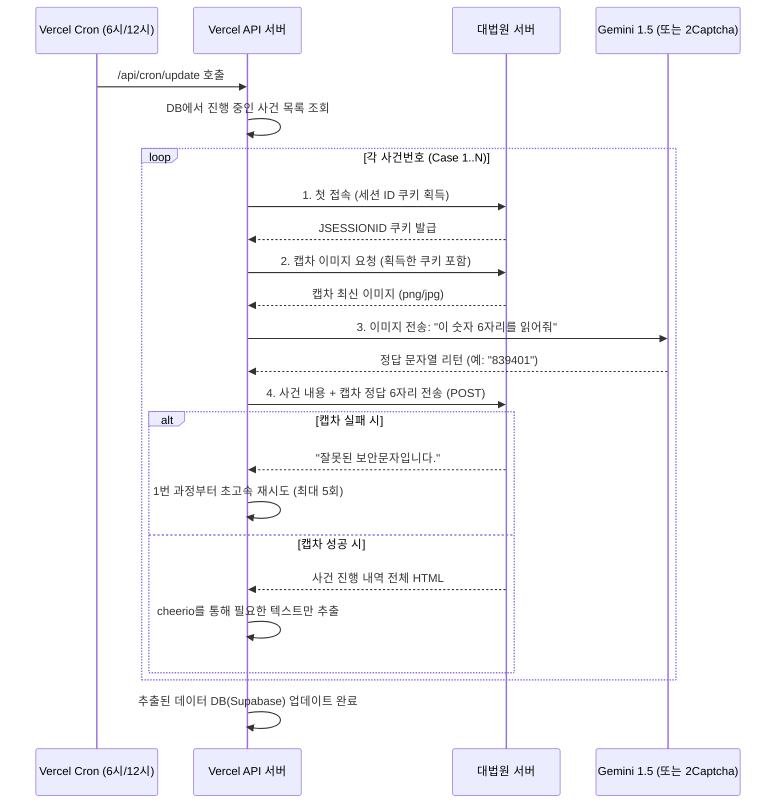

# Option A: Vercel Native HTTP 통신 + AI 캡차 우회 아키텍처 상세

이 문서는 Vercel 환경 내부에서 브라우저(크롬 등)를 띄우지 않고, **순수 HTTP 통신과 생성형 AI 비전 기술을 결합하여 대법원 나의사건검색 크롤링을 100% 무인화**하는 **Option A** 방식의 상세 기술 작동 원리입니다.

---

## 1. 핵심 원리: "브라우저 없는 가벼움"

보통 크롤링이라고 하면 화면을 캡처하고 마우스 클릭을 흉내내는 '브라우저 띄우기(Puppeteer/Selenium)'를 생각합니다. 하지만 이 방식은 150MB가 넘는 브라우저를 메모리에 올려야 하므로 Vercel 서버리스 환경에서는 치명적입니다.

**Option A**는 이를 탈피하여, 스마트폰 해커처럼 대법원 서버와 주고받는 "소스코드(HTTP 텍스트 패킷)"만을 보내고 받습니다.

- **속도**: 브라우저 로딩이 없어 실행 속도가 **0.1초~3초 내외**로 극단적으로 빠릅니다. (Vercel 타임아웃 제한 무력화)
- **메모리**: RAM 사용량이 거의 0에 수렴하여 Vercel Hobby/Pro 상관없이 펑펑 쓸 수 있습니다.
- **다량 처리**: 아침 6시에 수 십 개의 사건번호를 동시에 조회해도 서버가 전혀 버벅거리지 않습니다.

---

## 2. 작동 프로세스 (Workflow)

브라우저가 없기 때문에 컴퓨터가 스스로 "세션(쿠키)"을 들고 다니면서 캡차 이미지를 빼오고, 정답을 제출해야 합니다. 전체 플로우는 아래와 같습니다.

---

## 3. 기술적 해결 포인트: 캡차 (CAPTCHA) 우회

대법원 검색창에 뜨는 6자리 숫자(보안문자)는 봇을 막기 위해 픽셀에 노이즈(선, 점 등)가 섞여 있습니다. 이를 어떻게 돌파하는가?

1. **Gemini 1.5 Flash (Vision) 사용** (현재 최우선 고려 대상)
   - Vercel에 이미 Google Gemini API가 연동되어 있다면, 봇이 다운로드한 캡차 이미지를 Base64 형태로 변경해 Gemini에게 전송합니다.
   - 프롬프트: *"너는 보안 캡차 솔버야. 이미지에 보이는 숫자 6자리만 리턴해."* 
   - 성능: 최신 LLM 비전 모델들은 이 정도의 노이즈 캡차를 쉽게 구분합니다. 비용도 거의 무료에 가깝거나 무시할 수준입니다.

2. **2Captcha API 사용** (Backup Plan)
   - 만약 대법원이 보안을 높여서 노이즈가 너무 심해 AI가 틀리는 빈도가 높아진다면 사용하는 보험용 방안입니다. 
   - 러시아/동남아 등지의 전 세계 사람들이 실시간으로 대신 캡차 이미지를 보고 쳐주는 글로벌 B2B 서비스 API입니다.
   - 정확도 99% 이상이며, 비용은 1,000건 해독당 약 0.5~1달러 정도로 매우 저렴합니다.

### "틀렸을 때의 복구(Retry) 전략"
AI가 숫자 1과 7을 헷갈려서 틀리더라도 전혀 문제가 안 됩니다. 
브라우저를 껐다 킬 필요 없이 코드가 실패 응답을 받자마자 **약 0.2초 만에** 새로운 캡차 이미지를 재요청해서 다시 AI에게 보내는 **While 루프(무한 반복 방어코드)**가 짜여 있기 때문에, 사용자(당사자)는 에러가 났는지 전혀 인지하지 못합니다. 

---

## 4. 실제 DB 업데이트 연동

사건 번호 1개를 돌리는 데 이 모든 과정(AI 캡차 풀이 포함)이 보통 **1~3초** 안에 성공합니다. 
아침 6시 00분이 되면 Vercel 서버는 진행 중인 우리 법인의 회사 사건 50개를 찾아내고, 
`Promise.all` 기반의 병렬(비동기) 네트워크 요청을 쏘아보냅니다.

그리고 추출된 "결과", "다음 재판 기일" 텍스트를 파싱(`cheerio`)하여 `MOCK_COURT_DB`를 실제 Supabase 등 라이브 DB의 해당 고객사 사건 테이블로 `UPDATE` 시킵니다.

## Open Questions

> [!TIP]
> Option A의 아키텍처는 가볍고 매우 견고합니다. 
> 
> 이 세부 아키텍처 설명으로 Option A 방식에 대한 확신이 드셨다면, **"이대로 개발 진행해줘"** 라고 승인해주시면 됩니다. 
> 곧바로 `vercel.json` 세팅 및 Vercel용 `/api/cron/update-cases` 뼈대(캡차 통신/파싱 템플릿 로직) 구현을 시작할 수 있습니다!
